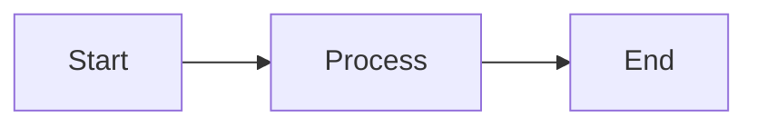

<p align="center">
  
</p>

<h1 align="center">MerMark Editor</h1>

<p align="center">
  <strong>A modern, open-source Markdown editor with built-in Mermaid diagram support</strong>
</p>

<p align="center">
  <a href="https://github.com/Vesperino/MerMarkEditor/releases"></a>
  <a href="https://github.com/Vesperino/MerMarkEditor/blob/master/LICENSE"></a>
  <a href="https://github.com/Vesperino/MerMarkEditor/stargazers"></a>
  <a href="https://github.com/Vesperino/MerMarkEditor/releases"></a>
</p>

<p align="center">
  <a href="#features">Features</a> •
  <a href="#screenshots">Screenshots</a> •
  <a href="#installation">Installation</a> •
  <a href="#usage">Usage</a> •
  <a href="#development">Development</a> •
  <a href="README_PL.md">Polski</a>
</p>

---

## Why MerMark Editor?

**MerMark Editor** combines the simplicity of Markdown with the power of Mermaid diagrams in a beautiful, native desktop application. Perfect for developers, technical writers, and anyone who needs to create documentation with flowcharts, sequence diagrams, and other visualizations.

### Key Benefits

- **No cloud dependency** - Your documents stay on your computer
- **Native performance** - Built with Tauri for fast, lightweight operation
- **WYSIWYG editing** - See your formatted content as you type
- **Mermaid integration** - Create diagrams directly in your documents
- **Cross-platform** - Available for Windows, macOS, and Linux

---

## Features

### Markdown Editing
- Full **GitHub Flavored Markdown** (GFM) support
- **WYSIWYG editor** with live preview
- **Syntax highlighting** for code blocks (50+ languages)
- Tables, task lists, blockquotes, and more
- **Keyboard shortcuts** for efficient editing

### Mermaid Diagrams
- **Flowcharts** - Visualize processes and workflows
- **Sequence diagrams** - Document system interactions
- **Class diagrams** - Design software architecture
- **State diagrams** - Model state machines
- **Entity Relationship diagrams** - Database design
- **Gantt charts** - Project planning
- **Pie charts** - Data visualization
- And many more diagram types!

### Export & Integration
- **Export to PDF** with proper formatting
- **Save as Markdown** (.md files)
- Clean, portable file format

### User Experience
- **Tab support** - Work with multiple documents
- **Dark/Light themes** - Easy on the eyes
- **Character & word count** - Track your progress
- **Auto-save** - Never lose your work

---

## Screenshots

<!-- PLACEHOLDER: Main editor screenshot -->
<p align="center">
  
  <br>
  <em>Clean, distraction-free editing interface</em>
</p>

<!-- PLACEHOLDER: Mermaid diagram screenshot -->
<p align="center">
  
  <br>
  <em>Create beautiful diagrams with Mermaid syntax</em>
</p>

<!-- PLACEHOLDER: Code highlighting screenshot -->
<p align="center">
  
  <br>
  <em>Syntax highlighting for 50+ programming languages</em>
</p>

---

## Installation

### Download

Download the latest version for your operating system from the [Releases page](https://github.com/Vesperino/MerMarkEditor/releases).

| Platform | Download |
|----------|----------|
| Windows  | [MerMark-Editor-x.x.x-setup.exe](https://github.com/Vesperino/MerMarkEditor/releases/latest) |
| macOS    | [MerMark-Editor-x.x.x.dmg](https://github.com/Vesperino/MerMarkEditor/releases/latest) |
| Linux    | [MerMark-Editor-x.x.x.AppImage](https://github.com/Vesperino/MerMarkEditor/releases/latest) |

### System Requirements

- **Windows**: Windows 10 or later
- **macOS**: macOS 10.15 (Catalina) or later
- **Linux**: Ubuntu 18.04 or equivalent

---

## Usage

### Basic Editing

1. **Open a file**: `Ctrl+O` (or `Cmd+O` on macOS)
2. **Save**: `Ctrl+S` (saves as Markdown)
3. **Save As**: `Ctrl+Shift+S`
4. **Export to PDF**: Click the PDF button in toolbar

### Markdown Shortcuts

| Action | Shortcut |
|--------|----------|
| Bold | `Ctrl+B` |
| Italic | `Ctrl+I` |
| Heading 1-6 | `Ctrl+Alt+1-6` |
| Code block | ` ``` ` |
| Link | `[text](url)` |
| Image | `` |

### Creating Mermaid Diagrams

Click the **Mermaid** button in the toolbar or type:

~~~markdown

~~~

This creates a flowchart:

```
[Start] --> [Process] --> [End]
```

### Supported Diagram Types

- `graph` / `flowchart` - Flow diagrams
- `sequenceDiagram` - Sequence diagrams
- `classDiagram` - Class diagrams
- `stateDiagram-v2` - State diagrams
- `erDiagram` - Entity Relationship diagrams
- `gantt` - Gantt charts
- `pie` - Pie charts
- `journey` - User journey diagrams
- `gitgraph` - Git graphs
- `mindmap` - Mind maps
- `timeline` - Timelines

---

## Development

### Prerequisites

- [Node.js](https://nodejs.org/) 18+
- [Rust](https://rustup.rs/) (for Tauri)
- [pnpm](https://pnpm.io/) (recommended)

### Setup

```bash
# Clone the repository
git clone https://github.com/Vesperino/MerMarkEditor.git
cd MerMarkEditor

# Install dependencies
pnpm install

# Run in development mode
pnpm tauri dev

# Build for production
pnpm tauri build
```

### Running Tests

```bash
# Run tests
pnpm test

# Run tests once
pnpm test:run
```

### Tech Stack

- **Frontend**: Vue 3 + TypeScript
- **Editor**: TipTap (ProseMirror-based)
- **Diagrams**: Mermaid.js
- **Desktop**: Tauri 2.0
- **Build**: Vite

---

## Contributing

Contributions are welcome! Please feel free to submit a Pull Request.

1. Fork the repository
2. Create your feature branch (`git checkout -b feature/AmazingFeature`)
3. Commit your changes (`git commit -m 'Add some AmazingFeature'`)
4. Push to the branch (`git push origin feature/AmazingFeature`)
5. Open a Pull Request

---

## License

This project is licensed under the **MIT License** - see the [LICENSE](LICENSE) file for details.

---

## Acknowledgments

- [TipTap](https://tiptap.dev/) - Headless editor framework
- [Mermaid](https://mermaid.js.org/) - Diagramming and charting tool
- [Tauri](https://tauri.app/) - Desktop application framework
- [Vue.js](https://vuejs.org/) - Progressive JavaScript framework

---

## Support

If you find this project useful, please consider:

- Giving it a star on GitHub
- Reporting bugs and suggesting features
- Contributing to the codebase

---

<p align="center">
  Made with ❤️ by <a href="https://github.com/Vesperino">Vesperino</a>
</p>

<!-- SEO Keywords (hidden): markdown editor, mermaid diagrams, flowchart editor, sequence diagram tool, documentation editor, technical writing, wysiwyg markdown, desktop markdown editor, open source markdown, diagram markdown editor, best markdown editor, free markdown editor, markdown with diagrams, mermaid markdown editor, offline markdown editor -->
