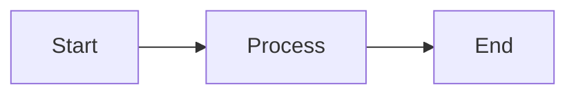

<p align="center">
  
</p>

<p align="center">
  <strong>A modern, open-source Markdown editor with built-in Mermaid diagram support</strong>
</p>

<p align="center">
  <a href="https://github.com/Vesperino/MerMarkEditor/releases"></a>
  <a href="https://github.com/Vesperino/MerMarkEditor/blob/master/LICENSE"></a>
  <a href="https://github.com/Vesperino/MerMarkEditor/stargazers"></a>
  <a href="https://github.com/Vesperino/MerMarkEditor/releases"></a>
</p>

<p align="center">
  <a href="#features">Features</a> •
  <a href="#screenshots">Screenshots</a> •
  <a href="#installation">Installation</a> •
  <a href="#usage">Usage</a> •
  <a href="#development">Development</a> •
  <a href="README_PL.md">Polski</a>
</p>

---

## Why MerMark Editor?

**MerMark Editor** combines the simplicity of Markdown with the power of Mermaid diagrams in a beautiful, native desktop application. Perfect for developers, technical writers, and anyone who needs to create documentation with flowcharts, sequence diagrams, and other visualizations.

### Key Benefits

- **No cloud dependency** - Your documents stay on your computer
- **Native performance** - Built with Tauri for fast, lightweight operation
- **WYSIWYG editing** - See your formatted content as you type
- **Mermaid integration** - Create diagrams directly in your documents
- **Cross-platform** - Available on Windows, macOS and Linux

---

## Features

### Markdown Editing
- Full **GitHub Flavored Markdown** (GFM) support
- **WYSIWYG editor** with live preview
- **Syntax highlighting** for code blocks (50+ languages)
- Tables, task lists, blockquotes, and more
- **Keyboard shortcuts** for efficient editing

### Mermaid Diagrams
- **Flowcharts** - Visualize processes and workflows
- **Sequence diagrams** - Document system interactions
- **Class diagrams** - Design software architecture
- **State diagrams** - Model state machines
- **Entity Relationship diagrams** - Database design
- **Gantt charts** - Project planning
- **Pie charts** - Data visualization
- And many more diagram types!

### Export & Integration
- **Export to PDF** with proper formatting
- **Save as Markdown** (.md files)
- Clean, portable file format

### User Experience
- **Tab support** - Work with multiple documents
- **Dark/Light themes** - Easy on the eyes
- **Character & word count** - Track your progress
- **Auto-save** - Never lose your work
- **Bilingual UI** - English and Polish interface
- **Keyboard shortcuts modal** - Quick reference for all shortcuts (`Ctrl+/`)

### Advanced Features
- **Split View** - Edit two documents side by side with adjustable split ratio
- **Compare Tabs** - Diff comparison between left and right pane documents (`Ctrl+Shift+C`)
- **Change Tracking** - View all changes made since last save (`Ctrl+Shift+D`)
- **Code View** - Switch between visual WYSIWYG and raw Markdown with cursor position tracking
- **AI Token Counter** - Estimate tokens for GPT (OpenAI), Claude (Anthropic), and Gemini (Google)
- **Multi-window support** - Open multiple independent editor windows
- **Cross-window tab management** - Drag and drop tabs between panes and windows

---

## Screenshots

<p align="center">
  <!-- TODO: Screenshot - Dark mode overview -->
  <code>[ SCREENSHOT: Dark mode overview ]</code>
  <br>
  <em>Dark mode</em>
</p>

<p align="center">
  <!-- TODO: Screenshot - Editor welcome / clean interface -->
  <code>[ SCREENSHOT: Clean interface with toolbar ]</code>
  <br>
  <em>Clean, minimalist interface with intuitive toolbar</em>
</p>

<p align="center">
  <!-- TODO: Screenshot - Document with table of contents -->
  <code>[ SCREENSHOT: Document with table of contents ]</code>
  <br>
  <em>Multi-tab editing with formatted documents and clickable table of contents</em>
</p>

<p align="center">
  <!-- TODO: Screenshot - Mermaid diagrams -->
  <code>[ SCREENSHOT: Mermaid diagrams ]</code>
  <br>
  <em>C4 Architecture diagrams with zoom controls and fullscreen mode</em>
</p>

<p align="center">
  <!-- TODO: Screenshot - Fullscreen diagram view -->
  <code>[ SCREENSHOT: Fullscreen diagram view ]</code>
  <br>
  <em>Fullscreen diagram view with 400% zoom for detailed inspection</em>
</p>

<p align="center">
  <!-- TODO: Screenshot - Code and documentation -->
  <code>[ SCREENSHOT: Code blocks and documentation ]</code>
  <br>
  <em>Technical documentation with code blocks and embedded diagrams</em>
</p>

<p align="center">
  <!-- TODO: Screenshot - Split view -->
  <code>[ SCREENSHOT: Split view ]</code>
  <br>
  <em>Split view for editing two documents simultaneously</em>
</p>

<p align="center">
  <!-- TODO: Screenshot - Compare tabs (diff) -->
  <code>[ SCREENSHOT: Compare tabs diff view ]</code>
  <br>
  <em>Compare documents side by side with line-level diff highlighting</em>
</p>

<p align="center">
  <!-- TODO: Screenshot - Change tracking -->
  <code>[ SCREENSHOT: Change tracking ]</code>
  <br>
  <em>View all changes made since last save with additions and deletions</em>
</p>

<p align="center">
  <!-- TODO: Screenshot - Code view -->
  <code>[ SCREENSHOT: Code view ]</code>
  <br>
  <em>Toggle between visual and Markdown code view with cursor tracking</em>
</p>

<p align="center">
  <!-- TODO: Screenshot - Keyboard shortcuts modal -->
  <code>[ SCREENSHOT: Keyboard shortcuts modal ]</code>
  <br>
  <em>Quick reference for all keyboard shortcuts (Ctrl+/)</em>
</p>

<p align="center">
  <!-- TODO: Screenshot - Token counter -->
  <code>[ SCREENSHOT: Token counter ]</code>
  <br>
  <em>AI token counter with model selection (GPT, Claude, Gemini)</em>
</p>

<p align="center">
  <!-- TODO: Screenshot - Multi-window -->
  <code>[ SCREENSHOT: Multi-window ]</code>
  <br>
  <em>Multiple windows with cross-window tab drag and drop</em>
</p>

---

## Installation

### Download

Download the latest version from the [Releases page](https://github.com/Vesperino/MerMarkEditor/releases).

| Platform | Download |
|----------|----------|
| Windows  | [.exe / .msi installer](https://github.com/Vesperino/MerMarkEditor/releases/latest) |
| macOS    | [.dmg (universal: Apple Silicon + Intel)](https://github.com/Vesperino/MerMarkEditor/releases/latest) |
| Linux    | [.deb / .AppImage](https://github.com/Vesperino/MerMarkEditor/releases/latest) |

### System Requirements

- **Windows**: Windows 10 or later (64-bit)
- **macOS**: macOS 10.15 (Catalina) or later
- **Linux**: Ubuntu 22.04+ or equivalent (WebKitGTK 4.1 required)

---

## Usage

### Basic Editing

1. **Open a file**: `Ctrl+O` (or `Cmd+O` on macOS)
2. **Save**: `Ctrl+S` (saves as Markdown)
3. **Save As**: `Ctrl+Shift+S`
4. **Export to PDF**: Click the PDF button in toolbar

### Keyboard Shortcuts

| Action | Shortcut |
|--------|----------|
| New file | `Ctrl+N` |
| Open file | `Ctrl+O` |
| Save | `Ctrl+S` |
| Save As | `Ctrl+Shift+S` |
| Export PDF | `Ctrl+P` |
| Undo | `Ctrl+Z` |
| Redo | `Ctrl+Y` |
| Bold | `Ctrl+B` |
| Italic | `Ctrl+I` |
| Show changes | `Ctrl+Shift+D` |
| Compare tabs | `Ctrl+Shift+C` |
| Keyboard shortcuts | `Ctrl+/` |
| Close modal | `Escape` |

### Creating Mermaid Diagrams

Click the **Mermaid** button in the toolbar or type:

~~~markdown

~~~

This creates a flowchart:

```
[Start] --> [Process] --> [End]
```

### Supported Diagram Types

- `graph` / `flowchart` - Flow diagrams
- `sequenceDiagram` - Sequence diagrams
- `classDiagram` - Class diagrams
- `stateDiagram-v2` - State diagrams
- `erDiagram` - Entity Relationship diagrams
- `gantt` - Gantt charts
- `pie` - Pie charts
- `journey` - User journey diagrams
- `gitgraph` - Git graphs
- `mindmap` - Mind maps
- `timeline` - Timelines

---

## Development

### Prerequisites

- [Node.js](https://nodejs.org/) 18+
- [Rust](https://rustup.rs/) (for Tauri)
- [pnpm](https://pnpm.io/) (recommended)

### Setup

```bash
# Clone the repository
git clone https://github.com/Vesperino/MerMarkEditor.git
cd MerMarkEditor

# Install dependencies
pnpm install

# Run in development mode
pnpm tauri dev

# Build for production
pnpm tauri build
```

### Running Tests

```bash
# Run tests
pnpm test

# Run tests once
pnpm test:run
```

### Tech Stack

- **Frontend**: Vue 3 + TypeScript
- **Editor**: TipTap (ProseMirror-based)
- **Diagrams**: Mermaid.js
- **Desktop**: Tauri 2.0
- **Build**: Vite

---

## Contributing

Contributions are welcome! Please feel free to submit a Pull Request.

1. Fork the repository
2. Create your feature branch (`git checkout -b feature/AmazingFeature`)
3. Commit your changes (`git commit -m 'Add some AmazingFeature'`)
4. Push to the branch (`git push origin feature/AmazingFeature`)
5. Open a Pull Request

---

## License

This project is licensed under the **MIT License** - see the [LICENSE](LICENSE) file for details.

---

## Acknowledgments

- [Codycody31](https://github.com/Codycody31) - Huge thanks for macOS and Linux support!
- [TipTap](https://tiptap.dev/) - Headless editor framework
- [Mermaid](https://mermaid.js.org/) - Diagramming and charting tool
- [Tauri](https://tauri.app/) - Desktop application framework
- [Vue.js](https://vuejs.org/) - Progressive JavaScript framework

---

## Support

If you find this project useful, please consider:

- Giving it a star on GitHub
- Reporting bugs and suggesting features
- Contributing to the codebase

---

<p align="center">
  Made with ❤️ by <a href="https://github.com/Vesperino">Vesperino</a>
</p>

<!-- SEO Keywords (hidden): markdown editor, mermaid diagrams, flowchart editor, sequence diagram tool, documentation editor, technical writing, wysiwyg markdown, desktop markdown editor, open source markdown, diagram markdown editor, best markdown editor, free markdown editor, markdown with diagrams, mermaid markdown editor, offline markdown editor -->
