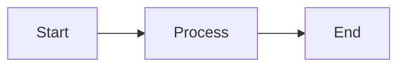

<p align="center">
  
</p>

<p align="center">
  <strong>A modern, open-source Markdown editor with built-in Mermaid diagram support</strong>
</p>

<p align="center">
  <a href="https://github.com/Vesperino/MerMarkEditor/releases"></a>
  <a href="https://github.com/Vesperino/MerMarkEditor/blob/master/LICENSE"></a>
  <a href="https://github.com/Vesperino/MerMarkEditor/stargazers"></a>
  <a href="https://github.com/Vesperino/MerMarkEditor/releases"></a>
  <a href="https://buymeacoffee.com/vesperinio"></a>
</p>

<p align="center">
  <a href="#local-ai-assistant">AI Assistant</a> •
  <a href="#features">Features</a> •
  <a href="#screenshots">Screenshots</a> •
  <a href="#installation">Installation</a> •
  <a href="#usage">Usage</a> •
  <a href="#development">Development</a>
</p>

<p align="center">
  <strong>English</strong> •
  <a href="README_PL.md">Polski</a> •
  <a href="README_ZH.md">中文</a>
</p>

---

## Why MerMark Editor?

**MerMark Editor** combines the simplicity of Markdown with the power of Mermaid diagrams in a beautiful, native desktop application. Perfect for developers, technical writers, and anyone who needs to create documentation with flowcharts, sequence diagrams, and other visualizations.

### Key Benefits

- **No cloud dependency** - Your documents stay on your computer
- **Native performance** - Built with Tauri for fast, lightweight operation
- **WYSIWYG editing** - See your formatted content as you type
- **Mermaid integration** - Create diagrams directly in your documents
- **Multi-root workspaces** - Open one folder or many; the AI sees them as scoped read-only context
- **Local AI assistant** - Talk to Claude, Codex, a fully offline Ollama model, or any OpenAI-compatible local server about your notes; they edit your files directly
- **Cross-platform** - Available on Windows, macOS and Linux

<p align="center">
  
  
</p>

---

## Local AI Assistant

If you already pay for **Claude Code** or **OpenAI Codex** — or both — MerMark plugs that subscription straight into the editor. The AI panel speaks to the `claude` and `codex` CLIs you already have logged in, so every request goes through the account you're already paying for. No API key to generate. No second bill. No proxy sitting between you and your provider.

<p align="center">
  
  <br>
  <em>AI panel docked next to the editor with model picker, threads dropdown, pinned fragments and live context bar</em>
</p>

### Use the subscription you already have

- **Claude Code or Codex on a Pro/Plus plan** — MerMark uses that login, no extra account.
- **No API token to manage** — the CLI handles auth, MerMark never sees your keys.
- **Direct to provider** — requests go from your machine straight to Anthropic or OpenAI; nothing else in between.
- **No telemetry** — zero data leaves the editor beyond the CLI call you'd run in a terminal yourself.
- **Switch providers per turn** — pick Claude for one chat, Codex for the next; all configured in one panel.

### Fully offline with Ollama

Prefer to keep everything on your own machine? Pick **Ollama** as the provider and chat against a local model — no account, no subscription, no network.

- **Requires a local [Ollama](https://ollama.com/download) install** running on your machine (`ollama serve`); pull a model first (e.g. `ollama pull llama3`).
- **Models are listed automatically** from your local install (`/api/tags`) — the model dropdown fills with whatever you've pulled.
- **Streams replies** straight from the local HTTP API; token usage is surfaced in the context bar just like the cloud providers.
- **Configurable base URL** in *Settings → AI* (defaults to `http://localhost:11434`) if Ollama runs on another host or port.
- **Graceful when offline** — if Ollama isn't running, the provider shows as *Not running* with a clear hint instead of failing silently.

### Any OpenAI-compatible local server

Run your own model server? Pick **OpenAI-compatible** as the provider and point it at any server that speaks the OpenAI HTTP API — [llama.cpp `llama-server`](https://github.com/ggml-org/llama.cpp/tree/master/tools/server), LM Studio, vLLM, a local Mistral, or even Ollama's own `/v1` endpoint.

- **Speaks the OpenAI API** — `POST /v1/chat/completions` (streamed SSE) and `GET /v1/models`; no account, no subscription, no network beyond your server.
- **Models are listed automatically** from `/v1/models` — the dropdown fills with every model your server exposes.
- **Streams replies** straight from the local HTTP API; token usage is surfaced in the context bar just like the cloud providers.
- **Configurable base URL** in *Settings → AI* (defaults to `http://localhost:8080`); the `/v1` path is appended automatically, so a base that already ends in `/v1` is not doubled.
- **Graceful when offline** — if the server isn't running, the provider shows as *Not running* with a clear hint instead of failing silently.

### What it can do

- **Edit your markdown directly** — "rewrite this section, friendlier tone", "extract action items", "translate to English". Writes straight to disk atomically; the editor reloads.
- **Read across folders you authorize** — point the access map at a project folder and the AI sees yesterday's notes, your glossary, your style guide.
- **Modify peer files** — split a long doc into multiple notes, generate a summary alongside the source, build a TOC file for a folder.
- **Search the web** — toggle the `network` tool on when you need fresh information.
- **Run shell commands** — opt-in `bash` toggle for grepping notes, running a build, anything terminal. Default off.
- **Auto-snapshot every AI write** — one-click **Revert** if the result isn't what you wanted.

### Multi-fragment selection and image attachments

- Pin one or more highlighted fragments — Visual *and* Code view.
- The AI receives only those fragments, not the entire document.
- Toggle **Send** off to keep pins visible without sending this turn.
- Paste a screenshot (`Ctrl+V`), drag-drop an image, or pick from disk.
- 8 MB per image, png / jpg / gif / webp / bmp.
- Both Claude and Codex see the image.
- Sent images stay in chat history as thumbnails so you remember what you passed.

<p align="center">
  
  <br>
  <em>Pin multiple highlighted fragments before sending — each appears as a numbered chip in the composer</em>
</p>

### Tool calls visible in the chat

- Every tool the model invokes shows up inline as a dashed chip in the transcript.
- Chip carries the tool name and a one-line preview of the arguments.
- Click to expand a pretty-printed JSON view of the full call.
- Covers Read, Edit, Write, Bash, WebFetch, codex shell — all of them.

<p align="center">
  
  <br>
  <em>Every tool the AI uses (Read, Edit, Write, Bash, WebFetch, ...) shows up inline as an expandable chip</em>
</p>

### Per-document threads with context restore

- Every doc has its own scrollable thread history.
- **+** archives the current chat and starts a fresh one.
- Up to 50 threads per document, persisted in `localStorage`.
- Reopening an old thread restores the CLI, model, and reasoning effort you were using.

### Safety, auditability, per-document access control

- Per-document access map: explicit read paths, write paths, tool toggles.
- Add files with **+ File**, whole folders with **+ Folder**.
- Pre-edit snapshots auto-rotated (default 3 + pinned), one-click **Revert**.
- Statusbar dot: green / red / blinking-red (bypass on).
- Append-only audit log of every AI action, viewable in Settings.

<p align="center">
  
  <br>
  <em>Per-document access map — explicit read / write paths plus tool toggles</em>
</p>

<p align="center">
  
  <br>
  <em>Snapshot history — restore, pin, export or delete pre-edit revisions</em>
</p>

### Two providers, one panel

- Switch `claude` / `codex` from the chat header.
- Per-CLI defaults persist (last model, last effort).
- Token streaming with a thinking indicator until the first chunk arrives.
- Segmented context-usage bar — input, cache, free — pulled from the CLI's reported usage.
- Clickable links open through the editor's external-link confirm dialog.
- Send shortcut: `Ctrl+Enter` (Win/Linux), `Cmd+Enter` (macOS).
- Minimize to a side tab, fullscreen, close — all in the panel header.

### AI editing for Mermaid diagrams

- Click **AI** on any diagram (or in fullscreen mermaid edit) — the main panel auto-pins the diagram source as scoped context and switches its preamble into mermaid-edit mode.
- Same panel, same model picker, same multi-turn conversation you use for prose.
- Each assistant reply is parsed for a `mermaid` fenced block and rendered live in place of the saved diagram.
- **Apply ✓ / Discard × / Stop** buttons appear in the panel chip; Apply commits to the node, Discard keeps iterating, Stop ends the session.

The full feature list — including snapshot rotation, tmp-recovery on crashed sessions, multi-window-safe streaming and per-CLI session isolation — lives in [RELEASE_NOTES.md](RELEASE_NOTES.md).

---

## Features

### Markdown Editing
- Full **GitHub Flavored Markdown** (GFM) support
- **WYSIWYG editor** with live preview
- **Syntax highlighting** for code blocks (50+ languages)
- Tables, task lists, blockquotes, and more
- **Keyboard shortcuts** for efficient editing
- **Configurable padding** — top, side and bottom sliders in Settings

### Mermaid Diagrams
- **Flowcharts**, **sequence**, **class**, **state**, **ER**, **Gantt**, **pie** and many more diagram types
- **Resizable** in document — drag the right edge to set a custom width (persisted in markdown)
- **Resizable split** in fullscreen edit — drag the divider between code and preview pane
- **AI assist** — click AI on any diagram and the main AI panel takes over with the diagram pinned as context
- **Quick templates** — flowchart / sequence / class / state / ER / Gantt / pie / mindmap one-click inserts

### Workspaces
- **Multi-root sidebar** — open one folder or many; each gets a collapsible section with its own file tree
- **File tree** — expand / collapse folders, open files in tabs, OS-level reveal, rename, delete, new file / new folder
- **AI sees the workspace** — workspace root is added to the AI preamble as a read-only scope automatically
- **Quick switcher** (`Ctrl+Shift+E`) — workspaces, files, full-text grep across the active workspace
- **Drag to reorder** workspaces; expanded folders persist between sessions

### Export & Integration
- **Export to PDF** — close to WYSIWYG: same serif font and scale as the editor, syntax-highlighted code blocks, coral inline code, content-sized tables
- **Save as Markdown** (.md files), clean portable format
- Editor padding settings translate into PDF margins

### User Experience
- **Tab support** with **pin / context menu** — Pin / Unpin / Close / Close others / Close all but pinned / Close saved
- **Dark/Light themes** plus a **Minimal theme variant** (Mermaid-logo palette: teal + coral on slate)
- **Word-style zoom slider** in the status bar — `±` buttons + percentage readout
- **Character / word / line / token counters** as a single movable unit
- **Styled prompt / confirm dialogs** throughout (no native browser modals)
- **Auto-save** — never lose your work
- **Trilingual UI** - English, Polish and Chinese interface
- **Keyboard shortcuts modal** - Quick reference for all shortcuts (`Ctrl+/`)

### Advanced Features
- **Split View** - Edit two documents side by side with adjustable split ratio
- **Compare Tabs** - Diff comparison between left and right pane documents (`Ctrl+Shift+C`)
- **Change Tracking** - View all changes made since last save (`Ctrl+Shift+D`)
- **Code View** - Switch between visual WYSIWYG and raw Markdown with cursor position tracking
- **AI Token Counter** - Estimate tokens for GPT (OpenAI), Claude (Anthropic), and Gemini (Google)
- **Multi-window support** - Open multiple independent editor windows
- **Cross-window tab management** - Drag and drop tabs between panes and windows
- **File watching** - Automatically detects external file changes and reloads content
- **Conflict detection** - Shows inline diff when both local and external changes exist
- **Manual reload** - Reload file from disk with `Ctrl+R`

---

## Screenshots

<p align="center">

  <br>
  <em>Dark mode</em>
</p>

<p align="center">

  <br>
  <em>Clean, minimalist interface with intuitive toolbar</em>
</p>

<p align="center">

  <br>
  <em>Multi-tab editing with formatted documents and clickable table of contents</em>
</p>

<p align="center">
  
  <br>
  <em>C4 Architecture diagrams with zoom controls and fullscreen mode</em>
</p>

<p align="center">
 
  <br>
  <em>Fullscreen diagram view with 400% zoom for detailed inspection</em>
</p>

<p align="center">
  
  <br>
  <em>Technical documentation with code blocks and embedded diagrams</em>
</p>

<p align="center">

  <br>
  <em>Split view for editing two documents simultaneously</em>
</p>

<p align="center">

  <br>
  <em>Compare documents side by side with line-level diff highlighting</em>
</p>

<p align="center">

  <br>
  <em>View all changes made since last save with additions and deletions</em>
</p>

<p align="center">

  <br>
  <em>Toggle between visual and Markdown code view with cursor tracking</em>
</p>

<p align="center">

  <br>
  <em>Quick reference for all keyboard shortcuts (Ctrl+/)</em>
</p>

<p align="center">

  <br>
  <em>AI token counter with model selection (GPT, Claude, Gemini)</em>
</p>

<p align="center">

  <br>
  <em>Multiple windows with cross-window tab drag and drop</em>
</p>

---

## Installation

### Download

Download the latest version from the [Releases page](https://github.com/Vesperino/MerMarkEditor/releases).

| Platform | Download |
|----------|----------|
| Windows  | [.exe / .msi installer](https://github.com/Vesperino/MerMarkEditor/releases/latest) |
| macOS    | [.dmg (universal: Apple Silicon + Intel)](https://github.com/Vesperino/MerMarkEditor/releases/latest) |
| Linux    | [.deb / .AppImage](https://github.com/Vesperino/MerMarkEditor/releases/latest) |

### Important Note

This app is open-source and not code-signed. Your OS may show a security warning on first launch:

- **Windows** (SmartScreen): Click "More info" → "Run anyway"
- **macOS**: Right-click the app → "Open" → "Open" to bypass Gatekeeper

This is standard behavior for open-source software distributed without a paid code signing certificate. The source code is fully available for review in this repository.

### System Requirements

- **Windows**: Windows 10 or later (64-bit)
- **macOS**: macOS 10.15 (Catalina) or later
- **Linux**: Ubuntu 22.04+ or equivalent (WebKitGTK 4.1 required)

---

## Usage

### Basic Editing

1. **Open a file**: `Ctrl+O` (or `Cmd+O` on macOS)
2. **Save**: `Ctrl+S` (saves as Markdown)
3. **Save As**: `Ctrl+Shift+S`
4. **Export to PDF**: Click the PDF button in toolbar

### Keyboard Shortcuts

| Action | Shortcut |
|--------|----------|
| New file | `Ctrl+N` |
| Open file | `Ctrl+O` |
| Save | `Ctrl+S` |
| Save As | `Ctrl+Shift+S` |
| Export PDF | `Ctrl+P` |
| Undo | `Ctrl+Z` |
| Redo | `Ctrl+Y` |
| Bold | `Ctrl+B` |
| Italic | `Ctrl+I` |
| Show changes | `Ctrl+Shift+D` |
| Compare tabs | `Ctrl+Shift+C` |
| Reload file | `Ctrl+R` |
| Close tab | `Ctrl+W` |
| Next tab | `Ctrl+Tab` |
| Previous tab | `Ctrl+Shift+Tab` |
| Jump to tab 1–9 | `Ctrl+1` … `Ctrl+9` |
| Toggle Code / Visual view | `Ctrl+Shift+V` |
| Zoom in / out | `Ctrl++` / `Ctrl+-` |
| Reset zoom | `Ctrl+0` |
| Settings | `Ctrl+,` |
| Keyboard shortcuts | `Ctrl+/` |
| Close modal | `Escape` |

> On macOS, use `⌘` (Cmd) in place of `Ctrl`.

### Creating Mermaid Diagrams

Click the **Mermaid** button in the toolbar or type:

~~~markdown

```mermaid
graph LR
    A[Start] --> B[Process]
    B --> C[End]
```
~~~

This creates a flowchart:

```
[Start] --> [Process] --> [End]
```

### Supported Diagram Types

- `graph` / `flowchart` - Flow diagrams
- `sequenceDiagram` - Sequence diagrams
- `classDiagram` - Class diagrams
- `stateDiagram-v2` - State diagrams
- `erDiagram` - Entity Relationship diagrams
- `gantt` - Gantt charts
- `pie` - Pie charts
- `journey` - User journey diagrams
- `gitgraph` - Git graphs
- `mindmap` - Mind maps
- `timeline` - Timelines

---

## Development

### Prerequisites

- [Node.js](https://nodejs.org/) 18+
- [Rust](https://rustup.rs/) (for Tauri)
- [pnpm](https://pnpm.io/) (recommended)

### Setup

```bash
# Clone the repository
git clone https://github.com/Vesperino/MerMarkEditor.git
cd MerMarkEditor

# Install dependencies
pnpm install

# Run in development mode
pnpm tauri dev

# Build for production
pnpm tauri build
```

### Running Tests

```bash
# Run tests
pnpm test

# Run tests once
pnpm test:run
```

### Tech Stack

- **Frontend**: Vue 3 + TypeScript
- **Editor**: TipTap (ProseMirror-based)
- **Diagrams**: Mermaid.js
- **Desktop**: Tauri 2.0
- **Build**: Vite

---

## Contributing

Contributions are welcome! Please feel free to submit a Pull Request.

1. Fork the repository
2. Create your feature branch (`git checkout -b feature/AmazingFeature`)
3. Commit your changes (`git commit -m 'Add some AmazingFeature'`)
4. Push to the branch (`git push origin feature/AmazingFeature`)
5. Open a Pull Request

---

## License

This project is licensed under the **MIT License** - see the [LICENSE](LICENSE) file for details.

---

## Acknowledgments

- [Codycody31](https://github.com/Codycody31) - Huge thanks for macOS and Linux support!
- [TipTap](https://tiptap.dev/) - Headless editor framework
- [Mermaid](https://mermaid.js.org/) - Diagramming and charting tool
- [Tauri](https://tauri.app/) - Desktop application framework
- [Vue.js](https://vuejs.org/) - Progressive JavaScript framework

---

## Support

MerMark is and will stay free and open source under the MIT license. If you find this project useful, please consider:

- Giving it a star on GitHub
- Reporting bugs and suggesting features
- Contributing to the codebase
- [Buying me a coffee](https://buymeacoffee.com/vesperinio) — totally optional, just a way to say thanks if MerMark saves you time

<p align="center">
  <a href="https://buymeacoffee.com/vesperinio">
    
  </a>
</p>

---

<p align="center">
  Made with ❤️ by <a href="https://github.com/Vesperino">Vesperino</a>
</p>

<!-- SEO Keywords (hidden): markdown editor, mermaid diagrams, flowchart editor, sequence diagram tool, documentation editor, technical writing, wysiwyg markdown, desktop markdown editor, open source markdown, diagram markdown editor, best markdown editor, free markdown editor, markdown with diagrams, mermaid markdown editor, offline markdown editor -->
