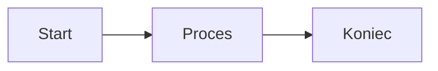

<p align="center">
  
</p>

<p align="center">
  <strong>Nowoczesny, otwartoźródłowy edytor Markdown z wbudowaną obsługą diagramów Mermaid</strong>
</p>

<p align="center">
  <a href="https://github.com/Vesperino/MerMarkEditor/releases"></a>
  <a href="https://github.com/Vesperino/MerMarkEditor/blob/master/LICENSE"></a>
  <a href="https://github.com/Vesperino/MerMarkEditor/stargazers"></a>
  <a href="https://github.com/Vesperino/MerMarkEditor/releases"></a>
</p>

<p align="center">
  <a href="#funkcje">Funkcje</a> •
  <a href="#zrzuty-ekranu">Zrzuty ekranu</a> •
  <a href="#instalacja">Instalacja</a> •
  <a href="#użytkowanie">Użytkowanie</a> •
  <a href="#rozwój">Rozwój</a> •
  <a href="README.md">English</a>
</p>

---

## Dlaczego MerMark Editor?

**MerMark Editor** łączy prostotę Markdown z mocą diagramów Mermaid w pięknej, natywnej aplikacji desktopowej. Idealny dla programistów, autorów dokumentacji technicznej i każdego, kto potrzebuje tworzyć dokumentację z diagramami przepływu, sekwencji i innymi wizualizacjami.

### Główne zalety

- **Bez zależności od chmury** - Twoje dokumenty zostają na Twoim komputerze
- **Natywna wydajność** - Zbudowany z Tauri dla szybkiego, lekkiego działania
- **Edycja WYSIWYG** - Zobacz sformatowaną treść podczas pisania
- **Integracja Mermaid** - Twórz diagramy bezpośrednio w dokumentach
- **Wieloplatformowy** - Dostępny na Windows, macOS i Linux

---

## Funkcje

### Edycja Markdown
- Pełna obsługa **GitHub Flavored Markdown** (GFM)
- **Edytor WYSIWYG** z podglądem na żywo
- **Kolorowanie składni** dla bloków kodu (50+ języków)
- Tabele, listy zadań, cytaty i więcej
- **Skróty klawiszowe** dla efektywnej edycji

### Diagramy Mermaid
- **Diagramy przepływu** - Wizualizacja procesów i workflow
- **Diagramy sekwencji** - Dokumentowanie interakcji systemów
- **Diagramy klas** - Projektowanie architektury oprogramowania
- **Diagramy stanów** - Modelowanie maszyn stanów
- **Diagramy relacji encji** - Projektowanie baz danych
- **Wykresy Gantta** - Planowanie projektów
- **Wykresy kołowe** - Wizualizacja danych
- I wiele innych typów diagramów!

### Eksport i integracja
- **Eksport do PDF** z odpowiednim formatowaniem
- **Zapis jako Markdown** (pliki .md)
- Czysty, przenośny format plików

### Doświadczenie użytkownika
- **Obsługa zakładek** - Praca z wieloma dokumentami
- **Jasny/Ciemny motyw** - Komfort dla oczu
- **Licznik znaków i słów** - Śledź postępy
- **Automatyczny zapis** - Nigdy nie stracisz pracy
- **Dwujęzyczny interfejs** - Polski i angielski
- **Modal skrótów klawiszowych** - Szybki podgląd wszystkich skrótów (`Ctrl+/`)

### Zaawansowane funkcje
- **Widok podzielony** - Edycja dwóch dokumentów obok siebie z regulowaną proporcją
- **Porównywanie zakładek** - Porównanie diff między dokumentami w lewym i prawym panelu (`Ctrl+Shift+C`)
- **Śledzenie zmian** - Podgląd wszystkich zmian od ostatniego zapisu (`Ctrl+Shift+D`)
- **Widok kodu** - Przełączanie między edytorem wizualnym a kodem Markdown ze śledzeniem kursora
- **Licznik tokenów AI** - Szacowanie tokenów dla GPT (OpenAI), Claude (Anthropic) i Gemini (Google)
- **Obsługa wielu okien** - Otwieranie wielu niezależnych okien edytora
- **Zarządzanie kartami między oknami** - Przeciąganie kart między panelami i oknami

---

## Zrzuty ekranu

<p align="center">
  <!-- TODO: Zrzut - Tryb ciemny -->
  <code>[ ZRZUT EKRANU: Tryb ciemny ]</code>
  <br>
  <em>Tryb ciemny</em>
</p>

<p align="center">
  <!-- TODO: Zrzut - Czysty interfejs -->
  <code>[ ZRZUT EKRANU: Czysty interfejs z paskiem narzędzi ]</code>
  <br>
  <em>Czysty, minimalistyczny interfejs z intuicyjnym paskiem narzędzi</em>
</p>

<p align="center">
  <!-- TODO: Zrzut - Dokument ze spisem treści -->
  <code>[ ZRZUT EKRANU: Dokument ze spisem treści ]</code>
  <br>
  <em>Edycja wielu dokumentów w zakładkach z klikalnym spisem treści</em>
</p>

<p align="center">
  <!-- TODO: Zrzut - Diagramy Mermaid -->
  <code>[ ZRZUT EKRANU: Diagramy Mermaid ]</code>
  <br>
  <em>Diagramy architektury C4 z kontrolą powiększenia i trybem pełnoekranowym</em>
</p>

<p align="center">
  <!-- TODO: Zrzut - Pełnoekranowy widok diagramu -->
  <code>[ ZRZUT EKRANU: Pełnoekranowy widok diagramu ]</code>
  <br>
  <em>Pełnoekranowy widok diagramu z 400% powiększeniem dla szczegółowej inspekcji</em>
</p>

<p align="center">
  <!-- TODO: Zrzut - Kod i dokumentacja -->
  <code>[ ZRZUT EKRANU: Bloki kodu i dokumentacja ]</code>
  <br>
  <em>Dokumentacja techniczna z blokami kodu i osadzonymi diagramami</em>
</p>

<p align="center">
  <!-- TODO: Zrzut - Widok podzielony -->
  <code>[ ZRZUT EKRANU: Widok podzielony ]</code>
  <br>
  <em>Widok podzielony do edycji dwóch dokumentów jednocześnie</em>
</p>

<p align="center">
  <!-- TODO: Zrzut - Porównywanie zakładek (diff) -->
  <code>[ ZRZUT EKRANU: Porównanie zakładek - widok diff ]</code>
  <br>
  <em>Porównywanie dokumentów z podświetleniem różnic na poziomie linii</em>
</p>

<p align="center">
  <!-- TODO: Zrzut - Śledzenie zmian -->
  <code>[ ZRZUT EKRANU: Śledzenie zmian ]</code>
  <br>
  <em>Podgląd wszystkich zmian od ostatniego zapisu z dodaniami i usunięciami</em>
</p>

<p align="center">
  <!-- TODO: Zrzut - Widok kodu -->
  <code>[ ZRZUT EKRANU: Widok kodu ]</code>
  <br>
  <em>Przełączanie między widokiem wizualnym a kodem Markdown ze śledzeniem kursora</em>
</p>

<p align="center">
  <!-- TODO: Zrzut - Modal skrótów klawiszowych -->
  <code>[ ZRZUT EKRANU: Modal skrótów klawiszowych ]</code>
  <br>
  <em>Szybki podgląd wszystkich skrótów klawiszowych (Ctrl+/)</em>
</p>

<p align="center">
  <!-- TODO: Zrzut - Licznik tokenów -->
  <code>[ ZRZUT EKRANU: Licznik tokenów ]</code>
  <br>
  <em>Licznik tokenów AI z wyborem modelu (GPT, Claude, Gemini)</em>
</p>

<p align="center">
  <!-- TODO: Zrzut - Wiele okien -->
  <code>[ ZRZUT EKRANU: Wiele okien ]</code>
  <br>
  <em>Wiele okien z przeciąganiem kart między oknami</em>
</p>

---

## Instalacja

### Pobieranie

Pobierz najnowszą wersję ze [strony wydań](https://github.com/Vesperino/MerMarkEditor/releases).

| Platforma | Pobierz |
|-----------|---------|
| Windows   | [.exe / .msi installer](https://github.com/Vesperino/MerMarkEditor/releases/latest) |
| macOS     | [.dmg (universal: Apple Silicon + Intel)](https://github.com/Vesperino/MerMarkEditor/releases/latest) |
| Linux     | [.deb / .AppImage](https://github.com/Vesperino/MerMarkEditor/releases/latest) |

### Wymagania systemowe

- **Windows**: Windows 10 lub nowszy (64-bit)
- **macOS**: macOS 10.15 (Catalina) lub nowszy
- **Linux**: Ubuntu 22.04+ lub odpowiednik (wymagany WebKitGTK 4.1)

---

## Użytkowanie

### Podstawowa edycja

1. **Otwórz plik**: `Ctrl+O` (lub `Cmd+O` na macOS)
2. **Zapisz**: `Ctrl+S` (zapisuje jako Markdown)
3. **Zapisz jako**: `Ctrl+Shift+S`
4. **Eksportuj do PDF**: Kliknij przycisk PDF w pasku narzędzi

### Skróty klawiszowe

| Akcja | Skrót |
|-------|-------|
| Nowy plik | `Ctrl+N` |
| Otwórz plik | `Ctrl+O` |
| Zapisz | `Ctrl+S` |
| Zapisz jako | `Ctrl+Shift+S` |
| Eksport PDF | `Ctrl+P` |
| Cofnij | `Ctrl+Z` |
| Ponów | `Ctrl+Y` |
| Pogrubienie | `Ctrl+B` |
| Kursywa | `Ctrl+I` |
| Pokaż zmiany | `Ctrl+Shift+D` |
| Porównaj zakładki | `Ctrl+Shift+C` |
| Skróty klawiszowe | `Ctrl+/` |
| Zamknij modal | `Escape` |

### Tworzenie diagramów Mermaid

Kliknij przycisk **Mermaid** w pasku narzędzi lub wpisz:

~~~markdown

~~~

To tworzy diagram przepływu:

```
[Start] --> [Proces] --> [Koniec]
```

### Obsługiwane typy diagramów

- `graph` / `flowchart` - Diagramy przepływu
- `sequenceDiagram` - Diagramy sekwencji
- `classDiagram` - Diagramy klas
- `stateDiagram-v2` - Diagramy stanów
- `erDiagram` - Diagramy relacji encji
- `gantt` - Wykresy Gantta
- `pie` - Wykresy kołowe
- `journey` - Diagramy ścieżki użytkownika
- `gitgraph` - Grafy Git
- `mindmap` - Mapy myśli
- `timeline` - Osie czasu

---

## Rozwój

### Wymagania wstępne

- [Node.js](https://nodejs.org/) 18+
- [Rust](https://rustup.rs/) (dla Tauri)
- [pnpm](https://pnpm.io/) (zalecane)

### Konfiguracja

```bash
# Sklonuj repozytorium
git clone https://github.com/Vesperino/MerMarkEditor.git
cd MerMarkEditor

# Zainstaluj zależności
pnpm install

# Uruchom w trybie deweloperskim
pnpm tauri dev

# Zbuduj wersję produkcyjną
pnpm tauri build
```

### Uruchamianie testów

```bash
# Uruchom testy
pnpm test

# Uruchom testy jednokrotnie
pnpm test:run
```

### Stos technologiczny

- **Frontend**: Vue 3 + TypeScript
- **Edytor**: TipTap (oparty na ProseMirror)
- **Diagramy**: Mermaid.js
- **Desktop**: Tauri 2.0
- **Build**: Vite

---

## Współtworzenie

Wkład jest mile widziany! Zachęcamy do tworzenia Pull Requestów.

1. Zforkuj repozytorium
2. Utwórz gałąź funkcji (`git checkout -b feature/NowaFunkcja`)
3. Zatwierdź zmiany (`git commit -m 'Dodaj NowaFunkcja'`)
4. Wypchnij gałąź (`git push origin feature/NowaFunkcja`)
5. Otwórz Pull Request

---

## Licencja

Ten projekt jest licencjonowany na warunkach **licencji MIT** - zobacz plik [LICENSE](LICENSE) po szczegóły.

---

## Podziękowania

- [Codycody31](https://github.com/Codycody31) - Wielkie podziękowania za wsparcie macOS i Linux!
- [TipTap](https://tiptap.dev/) - Framework edytora headless
- [Mermaid](https://mermaid.js.org/) - Narzędzie do tworzenia diagramów
- [Tauri](https://tauri.app/) - Framework aplikacji desktopowych
- [Vue.js](https://vuejs.org/) - Progresywny framework JavaScript

---

## Wsparcie

Jeśli uważasz ten projekt za użyteczny, rozważ:

- Danie gwiazdki na GitHub
- Zgłaszanie błędów i sugestii funkcji
- Wkład w kod źródłowy

---

<p align="center">
  Stworzone z ❤️ przez <a href="https://github.com/Vesperino">Vesperino</a>
</p>
