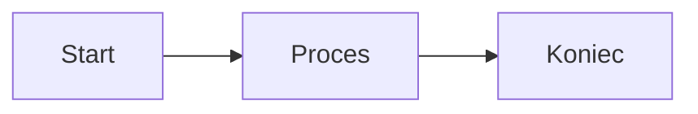

<p align="center">
  
</p>

<p align="center">
  <strong>Nowoczesny, otwartoźródłowy edytor Markdown z wbudowaną obsługą diagramów Mermaid</strong>
</p>

<p align="center">
  <a href="https://github.com/Vesperino/MerMarkEditor/releases"></a>
  <a href="https://github.com/Vesperino/MerMarkEditor/blob/master/LICENSE"></a>
  <a href="https://github.com/Vesperino/MerMarkEditor/stargazers"></a>
  <a href="https://github.com/Vesperino/MerMarkEditor/releases"></a>
</p>

<p align="center">
  <a href="#asystent-ai-lokalnie">Asystent AI</a> •
  <a href="#funkcje">Funkcje</a> •
  <a href="#zrzuty-ekranu">Zrzuty ekranu</a> •
  <a href="#instalacja">Instalacja</a> •
  <a href="#użytkowanie">Użytkowanie</a> •
  <a href="#rozwój">Rozwój</a>
</p>

<p align="center">
  <a href="README.md">English</a> •
  <strong>Polski</strong> •
  <a href="README_ZH.md">中文</a>
</p>

---

## Dlaczego MerMark Editor?

**MerMark Editor** łączy prostotę Markdown z mocą diagramów Mermaid w pięknej, natywnej aplikacji desktopowej. Idealny dla programistów, autorów dokumentacji technicznej i każdego, kto potrzebuje tworzyć dokumentację z diagramami przepływu, sekwencji i innymi wizualizacjami.

### Główne zalety

- **Bez zależności od chmury** - Twoje dokumenty zostają na Twoim komputerze
- **Natywna wydajność** - Zbudowany z Tauri dla szybkiego, lekkiego działania
- **Edycja WYSIWYG** - Zobacz sformatowaną treść podczas pisania
- **Integracja Mermaid** - Twórz diagramy bezpośrednio w dokumentach
- **Lokalny asystent AI** - Rozmawiaj z Claude lub Codex o swoich notatkach; AI edytuje pliki bezpośrednio
- **Wieloplatformowy** - Dostępny na Windows, macOS i Linux

---

## Asystent AI lokalnie

MerMark posiada wbudowany panel AI oparty o Twoje własne instalacje CLI `claude` i/lub `codex`. Wszystko działa lokalnie, na Twoim koncie — żadnego pośrednika, żadnej telemetrii, żadnych dodatkowych kluczy API.

<p align="center">
  
  <br>
  <em>Panel AI zadokowany przy edytorze — wybór modelu, lista wątków, przypięte fragmenty i pasek użycia kontekstu na żywo</em>
</p>

### Co naprawdę potrafi

- **Edytuje twój markdown bezpośrednio** — "przepisz tę sekcję bardziej przyjaznym tonem", "wyciągnij action items na listę", "przetłumacz notatki ze spotkania na angielski". AI zapisuje nową treść wprost na dysk (atomicznie, przez `.mermark-ai.tmp`), file watcher przeładowuje edytor, a snapshot zostaje zrobiony jako pierwszy — jeden klik **Cofnij** wycofuje zmianę.
- **Czyta z autoryzowanych folderów** — wskaż w access map folder projektu i AI przeczyta dowolny plik wewnątrz: notatki z wczoraj, glosariusz, style guide. Tylko ścieżki które dodałeś są widoczne.
- **Modyfikuje sąsiednie pliki** — write paths w access map pozwalają AI tworzyć i aktualizować inne pliki: rozdzielić długi dokument, wygenerować podsumowanie obok źródła, zbudować plik TOC dla folderu.
- **Przeszukuje sieć** — włącz przełącznik narzędzia `network` i model pobiera świeże informacje.
- **Uruchamia komendy shell** — opcjonalnie przez przełącznik `bash` gdy chcesz żeby AI przeszukało folder notatek, uruchomiło build albo dowolne zadanie terminalowe. Domyślnie wyłączone.

### Wielokrotne zaznaczenia + załączniki obrazów

Przypnij jeden lub więcej zaznaczonych fragmentów — Visual *i* Code view — a AI dostanie tylko te fragmenty, nie cały dokument. Wyłącz **Send** żeby zachować piny widoczne bez wysyłania. Wyślij zrzut ekranu do modelu wklejając (`Ctrl+V`), przeciągając do panelu, lub wybierając pliki (png / jpg / jpeg / gif / webp / bmp). Zarówno Claude jak i Codex widzą obraz.

<p align="center">
  
  <br>
  <em>Przypnij wiele zaznaczonych fragmentów przed wysłaniem — każdy pojawia się jako numerowany chip w composerze</em>
</p>

<p align="center">
  
  <br>
  <em>Wysłane obrazy zostają w historii czatu jako miniatury — pamiętasz dokładnie co przekazałeś modelowi</em>
</p>

<p align="center">
  
  <br>
  <em>End-to-end: trzy przypięte paragrafy + załączony screenshot + jedno polecenie — AI przepisuje tekst i opisuje obraz w jednej turze</em>
</p>

### Wywołania narzędzi widoczne w czacie

Gdy model używa narzędzia — bash, file read, file write, web fetch, codex shell — wywołanie pojawia się jako kreskowany chip w transkrypcie z nazwą narzędzia i jednolinijkowym podglądem argumentów. Kliknij chip aby rozwinąć pełny wywołanie w pretty-printed JSON.

<p align="center">
  
  <br>
  <em>Każde narzędzie którego używa AI (Read, Edit, Write, Bash, WebFetch, ...) widoczne jako rozwijalny chip</em>
</p>

### Wątki per dokument z pełnym przywracaniem kontekstu

Każdy dokument ma własną historię wątków; **+** archiwizuje aktualny czat i zaczyna nowy. Do 50 wątków na dokument, zapisane w `localStorage`. Kliknij stary czat z listy a panel automatycznie przełączy Claude ↔ Codex i przywróci model + reasoning effort z którego ostatnio korzystałeś — kontynuacja rozmowy zachowuje się tak jak ostatnim razem.

### Bezpieczeństwo, audyt i kontrola dostępu per dokument

Snapshoty przed edycją są tworzone automatycznie przy każdym zapisie AI, z rotacyjną retencją (przypięte + N najnowszych, domyślnie 3) i jednym kliknięciem **Cofnij**. Per-dokument access map ogranicza wszystko czego model może dotknąć: read paths, write paths, przełączniki narzędzi (file read / file write / bash / network) — dodawaj pliki przez **+ File** lub całe foldery przez **+ Folder**. Wskaźnik w status barze pokazuje zielony / czerwony / mrugający czerwony (bypass on) — zawsze wiesz w jakim stanie jest panel.

<p align="center">
  
  <br>
  <em>Access map per dokument — wprost określone read / write paths i przełączniki narzędzi</em>
</p>

<p align="center">
  
  <br>
  <em>Historia snapshotów — przywróć, przypnij, eksportuj lub usuń wersje sprzed edycji</em>
</p>

### Dwóch dostawców, jeden panel

Przełączaj `claude` i `codex` z headera czatu. Domyślne ustawienia per CLI utrzymują się (ostatni model, ostatni effort). Streaming tokenów, segmentowy pasek użycia kontekstu, klikalne linki, skrót wysyłania (`Ctrl+Enter` / `Cmd+Enter`), minimalizacja do zakładki + fullscreen. Pełna lista funkcji w [RELEASE_NOTES.md](RELEASE_NOTES.md).

<p align="center">
  
  <br>
  <em>Streaming tokenów z segmentowym paskiem użycia kontekstu na żywo (input / cache / free)</em>
</p>

<p align="center">
  
  <br>
  <em>Ustawienia → AI — health instalacji i autentykacji, viewer audit logu, runtime bypass toggle</em>
</p>

---

## Funkcje

### Edycja Markdown
- Pełna obsługa **GitHub Flavored Markdown** (GFM)
- **Edytor WYSIWYG** z podglądem na żywo
- **Kolorowanie składni** dla bloków kodu (50+ języków)
- Tabele, listy zadań, cytaty i więcej
- **Skróty klawiszowe** dla efektywnej edycji

### Diagramy Mermaid
- **Diagramy przepływu** - Wizualizacja procesów i workflow
- **Diagramy sekwencji** - Dokumentowanie interakcji systemów
- **Diagramy klas** - Projektowanie architektury oprogramowania
- **Diagramy stanów** - Modelowanie maszyn stanów
- **Diagramy relacji encji** - Projektowanie baz danych
- **Wykresy Gantta** - Planowanie projektów
- **Wykresy kołowe** - Wizualizacja danych
- I wiele innych typów diagramów!

### Eksport i integracja
- **Eksport do PDF** z odpowiednim formatowaniem
- **Zapis jako Markdown** (pliki .md)
- Czysty, przenośny format plików

### Doświadczenie użytkownika
- **Obsługa zakładek** - Praca z wieloma dokumentami
- **Jasny/Ciemny motyw** - Komfort dla oczu
- **Licznik znaków i słów** - Śledź postępy
- **Automatyczny zapis** - Nigdy nie stracisz pracy
- **Dwujęzyczny interfejs** - Polski i angielski
- **Modal skrótów klawiszowych** - Szybki podgląd wszystkich skrótów (`Ctrl+/`)

### Zaawansowane funkcje
- **Widok podzielony** - Edycja dwóch dokumentów obok siebie z regulowaną proporcją
- **Porównywanie zakładek** - Porównanie diff między dokumentami w lewym i prawym panelu (`Ctrl+Shift+C`)
- **Śledzenie zmian** - Podgląd wszystkich zmian od ostatniego zapisu (`Ctrl+Shift+D`)
- **Widok kodu** - Przełączanie między edytorem wizualnym a kodem Markdown ze śledzeniem kursora
- **Licznik tokenów AI** - Szacowanie tokenów dla GPT (OpenAI), Claude (Anthropic) i Gemini (Google)
- **Obsługa wielu okien** - Otwieranie wielu niezależnych okien edytora
- **Zarządzanie kartami między oknami** - Przeciąganie kart między panelami i oknami
- **Obserwowanie plików** - Automatyczne wykrywanie zewnętrznych zmian i przeładowanie zawartości
- **Wykrywanie konfliktów** - Wyświetla porównanie diff gdy istnieją zarówno lokalne jak i zewnętrzne zmiany
- **Ręczne przeładowanie** - Przeładuj plik z dysku za pomocą `Ctrl+R`

---

## Zrzuty ekranu

<p align="center">

  <br>
  <em>Tryb ciemny</em>
</p>

<p align="center">

  <br>
  <em>Czysty, minimalistyczny interfejs z intuicyjnym paskiem narzędzi</em>
</p>

<p align="center">

  <br>
  <em>Edycja wielu dokumentów w zakładkach z klikalnym spisem treści</em>
</p>

<p align="center">

  <br>
  <em>Diagramy architektury C4 z kontrolą powiększenia i trybem pełnoekranowym</em>
</p>

<p align="center">

  <br>
  <em>Pełnoekranowy widok diagramu z 400% powiększeniem dla szczegółowej inspekcji</em>
</p>

<p align="center">

  <br>
  <em>Dokumentacja techniczna z blokami kodu i osadzonymi diagramami</em>
</p>

<p align="center">

  <br>
  <em>Widok podzielony do edycji dwóch dokumentów jednocześnie</em>
</p>

<p align="center">

  <br>
  <em>Porównywanie dokumentów z podświetleniem różnic na poziomie linii</em>
</p>

<p align="center">

  <br>
  <em>Podgląd wszystkich zmian od ostatniego zapisu z dodaniami i usunięciami</em>
</p>

<p align="center">

  <br>
  <em>Przełączanie między widokiem wizualnym a kodem Markdown ze śledzeniem kursora</em>
</p>

<p align="center">

  <br>
  <em>Szybki podgląd wszystkich skrótów klawiszowych (Ctrl+/)</em>
</p>

<p align="center">

  <br>
  <em>Licznik tokenów AI z wyborem modelu (GPT, Claude, Gemini)</em>
</p>

<p align="center">

  <br>
  <em>Wiele okien z przeciąganiem kart między oknami</em>
</p>

---

## Instalacja

### Pobieranie

Pobierz najnowszą wersję ze [strony wydań](https://github.com/Vesperino/MerMarkEditor/releases).

| Platforma | Pobierz |
|-----------|---------|
| Windows   | [.exe / .msi installer](https://github.com/Vesperino/MerMarkEditor/releases/latest) |
| macOS     | [.dmg (universal: Apple Silicon + Intel)](https://github.com/Vesperino/MerMarkEditor/releases/latest) |
| Linux     | [.deb / .AppImage](https://github.com/Vesperino/MerMarkEditor/releases/latest) |

### Wymagania systemowe

- **Windows**: Windows 10 lub nowszy (64-bit)
- **macOS**: macOS 10.15 (Catalina) lub nowszy
- **Linux**: Ubuntu 22.04+ lub odpowiednik (wymagany WebKitGTK 4.1)

---

## Użytkowanie

### Podstawowa edycja

1. **Otwórz plik**: `Ctrl+O` (lub `Cmd+O` na macOS)
2. **Zapisz**: `Ctrl+S` (zapisuje jako Markdown)
3. **Zapisz jako**: `Ctrl+Shift+S`
4. **Eksportuj do PDF**: Kliknij przycisk PDF w pasku narzędzi

### Skróty klawiszowe

| Akcja | Skrót |
|-------|-------|
| Nowy plik | `Ctrl+N` |
| Otwórz plik | `Ctrl+O` |
| Zapisz | `Ctrl+S` |
| Zapisz jako | `Ctrl+Shift+S` |
| Eksport PDF | `Ctrl+P` |
| Cofnij | `Ctrl+Z` |
| Ponów | `Ctrl+Y` |
| Pogrubienie | `Ctrl+B` |
| Kursywa | `Ctrl+I` |
| Pokaż zmiany | `Ctrl+Shift+D` |
| Porównaj zakładki | `Ctrl+Shift+C` |
| Przeładuj plik | `Ctrl+R` |
| Zamknij kartę | `Ctrl+W` |
| Następna karta | `Ctrl+Tab` |
| Poprzednia karta | `Ctrl+Shift+Tab` |
| Przejdź do karty 1–9 | `Ctrl+1` … `Ctrl+9` |
| Przełącz widok Kod / Wizualny | `Ctrl+Shift+V` |
| Powiększ / pomniejsz | `Ctrl++` / `Ctrl+-` |
| Reset powiększenia | `Ctrl+0` |
| Ustawienia | `Ctrl+,` |
| Skróty klawiszowe | `Ctrl+/` |
| Zamknij modal | `Escape` |

> Na macOS używaj `⌘` (Cmd) zamiast `Ctrl`.

### Tworzenie diagramów Mermaid

Kliknij przycisk **Mermaid** w pasku narzędzi lub wpisz:

~~~markdown

```mermaid
graph LR
    A[Start] --> B[Proces]
    B --> C[Koniec]
```
~~~

To tworzy diagram przepływu:

```
[Start] --> [Proces] --> [Koniec]
```

### Obsługiwane typy diagramów

- `graph` / `flowchart` - Diagramy przepływu
- `sequenceDiagram` - Diagramy sekwencji
- `classDiagram` - Diagramy klas
- `stateDiagram-v2` - Diagramy stanów
- `erDiagram` - Diagramy relacji encji
- `gantt` - Wykresy Gantta
- `pie` - Wykresy kołowe
- `journey` - Diagramy ścieżki użytkownika
- `gitgraph` - Grafy Git
- `mindmap` - Mapy myśli
- `timeline` - Osie czasu

---

## Rozwój

### Wymagania wstępne

- [Node.js](https://nodejs.org/) 18+
- [Rust](https://rustup.rs/) (dla Tauri)
- [pnpm](https://pnpm.io/) (zalecane)

### Konfiguracja

```bash
# Sklonuj repozytorium
git clone https://github.com/Vesperino/MerMarkEditor.git
cd MerMarkEditor

# Zainstaluj zależności
pnpm install

# Uruchom w trybie deweloperskim
pnpm tauri dev

# Zbuduj wersję produkcyjną
pnpm tauri build
```

### Uruchamianie testów

```bash
# Uruchom testy
pnpm test

# Uruchom testy jednokrotnie
pnpm test:run
```

### Stos technologiczny

- **Frontend**: Vue 3 + TypeScript
- **Edytor**: TipTap (oparty na ProseMirror)
- **Diagramy**: Mermaid.js
- **Desktop**: Tauri 2.0
- **Build**: Vite

---

## Współtworzenie

Wkład jest mile widziany! Zachęcamy do tworzenia Pull Requestów.

1. Zforkuj repozytorium
2. Utwórz gałąź funkcji (`git checkout -b feature/NowaFunkcja`)
3. Zatwierdź zmiany (`git commit -m 'Dodaj NowaFunkcja'`)
4. Wypchnij gałąź (`git push origin feature/NowaFunkcja`)
5. Otwórz Pull Request

---

## Licencja

Ten projekt jest licencjonowany na warunkach **licencji MIT** - zobacz plik [LICENSE](LICENSE) po szczegóły.

---

## Podziękowania

- [Codycody31](https://github.com/Codycody31) - Wielkie podziękowania za wsparcie macOS i Linux!
- [TipTap](https://tiptap.dev/) - Framework edytora headless
- [Mermaid](https://mermaid.js.org/) - Narzędzie do tworzenia diagramów
- [Tauri](https://tauri.app/) - Framework aplikacji desktopowych
- [Vue.js](https://vuejs.org/) - Progresywny framework JavaScript

---

## Wsparcie

MerMark jest i pozostanie darmowy oraz open source na licencji MIT. Jeśli uważasz ten projekt za użyteczny, rozważ:

- Danie gwiazdki na GitHub
- Zgłaszanie błędów i sugestii funkcji
- Wkład w kod źródłowy
- [Postawienie mi kawy](https://buymeacoffee.com/vesperinio) — całkowicie opcjonalnie, jeżeli MerMark oszczędza ci czas

<p align="center">
  <a href="https://buymeacoffee.com/vesperinio">
    
  </a>
</p>

---

<p align="center">
  Stworzone z ❤️ przez <a href="https://github.com/Vesperino">Vesperino</a>
</p>
