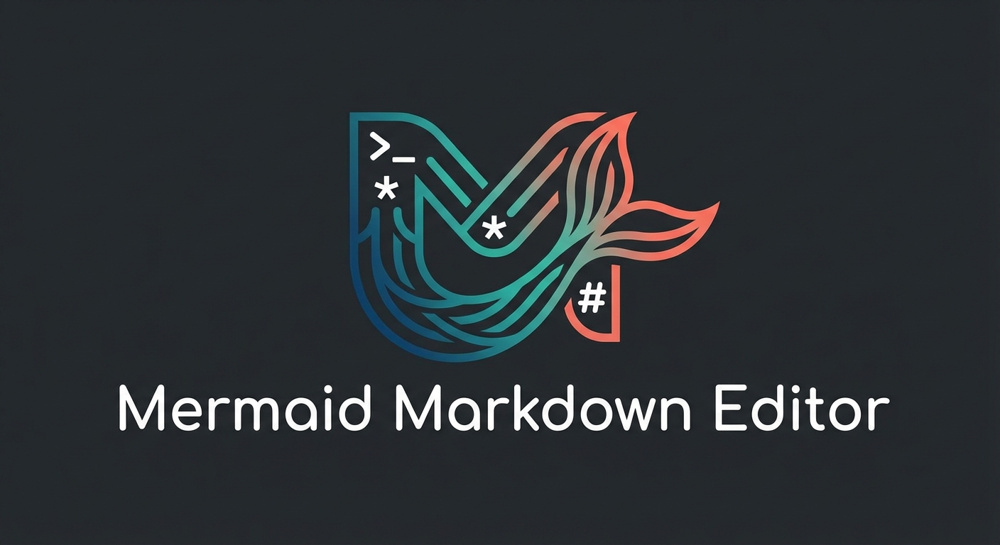

<p align="center">
  
</p>

<p align="center">
  <strong>现代化、开源的 Markdown 编辑器，内置 Mermaid 图表支持</strong>
</p>

<p align="center">
  <a href="https://github.com/Vesperino/MerMarkEditor/releases"></a>
  <a href="https://github.com/Vesperino/MerMarkEditor/blob/master/LICENSE"></a>
  <a href="https://github.com/Vesperino/MerMarkEditor/stargazers"></a>
  <a href="https://github.com/Vesperino/MerMarkEditor/releases"></a>
</p>

<p align="center">
  <a href="#本地-ai-助手">AI 助手</a> •
  <a href="#功能">功能</a> •
  <a href="#截图">截图</a> •
  <a href="#安装">安装</a> •
  <a href="#使用">使用</a> •
  <a href="#开发">开发</a>
</p>

<p align="center">
  <a href="README.md">English</a> •
  <a href="README_PL.md">Polski</a> •
  <strong>中文</strong>
</p>

---

## 为什么选择 MerMark Editor？

**MerMark Editor** 将 Markdown 的简洁性与 Mermaid 图表的强大功能融合在一个精美的原生桌面应用中。非常适合开发者、技术作者，以及任何需要使用流程图、时序图和其他可视化内容编写文档的人。

### 主要优势

- **无云端依赖** - 文档完全保留在你的电脑上
- **原生性能** - 基于 Tauri 构建，快速且轻量
- **所见即所得编辑** - 边输入边查看格式化内容
- **Mermaid 集成** - 直接在文档中创建图表
- **本地 AI 助手** - 与 Claude 或 Codex 对话来处理你的笔记，AI 会直接编辑文件
- **跨平台** - 支持 Windows、macOS 和 Linux

---

## 本地 AI 助手

MerMark 内置 AI 面板，由你自己安装的 `claude` 和/或 `codex` CLI 驱动。一切都在你的本地机器上运行，使用你自己的账户 — 没有第三方代理、没有遥测、不需要额外的 API 密钥。

<p align="center">
  
  <br>
  <em>AI 面板停靠在编辑器旁，包含模型选择器、会话下拉、固定的片段以及实时上下文使用条</em>
</p>

### 它真正能做什么

- **直接编辑你的 markdown** — "用更友好的语气重写这一段"、"把行动项提取成一个列表"、"将会议记录翻译成英文"。AI 会通过 `.mermark-ai.tmp` 原子写入磁盘，文件监视器随后重新加载编辑器，并且会先生成快照 — 一键 **撤销** 即可恢复修改。
- **跨你授权的文件夹读取** — 在访问图中指向项目文件夹，AI 就能读取里面的任何文件：昨天的笔记、术语表、风格指南。只有你显式添加的路径会出现。
- **修改同级文件** — 访问图里的 write paths 让 AI 创建或更新其他文件：把长文档拆成多份笔记、在源文件旁生成摘要、为某个文件夹建立 TOC 文件。
- **搜索网络** — 打开 `network` 工具开关，模型就能获取最新信息。
- **执行 shell 命令** — 通过 `bash` 工具开关按需启用，让 AI 在笔记目录中 grep、运行 build 或其他终端任务。默认关闭。

### 多片段选择 + 图片附件

在 Visual *和* Code 视图中固定一个或多个高亮片段，AI 只会得到这些片段，而不是整篇文档。关闭 **Send** 可以保留固定的片段但本次不发送。通过粘贴 (`Ctrl+V`)、拖拽到面板，或文件选择器（png / jpg / jpeg / gif / webp / bmp）将截图发送给模型。Claude 和 Codex 都能看到图片。

<p align="center">
  
  <br>
  <em>发送前固定多个高亮片段 — 每个片段都以编号 chip 的形式出现在 composer 里</em>
</p>

<p align="center">
  
  <br>
  <em>通过粘贴、拖放或文件选择器添加图片 — chip 上的缩略图可以点击预览</em>
</p>

<p align="center">
  
  <br>
  <em>已发送的图片以缩略图形式保留在聊天记录里 — 你能清楚记得给模型传过什么</em>
</p>

### 工具调用在聊天中可见

当模型使用工具时 — bash、文件读、文件写、web fetch、codex shell — 调用会以虚线 chip 的形式出现在记录中，包含工具名以及参数的一行预览。点击任意 chip 即可展开格式化的 JSON 完整调用视图。

<p align="center">
  
  <br>
  <em>AI 使用的每个工具（Read、Edit、Write、Bash、WebFetch ……）都会作为可展开的 chip 内联显示</em>
</p>

### 每文档独立会话，并完整恢复上下文

每个文档都有自己的会话历史；**+** 归档当前对话并新开一个。每个文档最多 50 个会话，存储在 `localStorage` 中。从下拉菜单中点选历史会话，面板会自动切换 Claude ↔ Codex，并恢复你上次使用的模型与推理强度 — 继续对话的体验和上次完全一致。

<p align="center">
  
  <br>
  <em>重新打开会话，面板会恢复你之前使用的 CLI、模型和 effort</em>
</p>

### 安全性、可审计性和按文档的访问控制

每次 AI 写入都会自动生成预编辑快照，采用轮转保留策略（已固定 + N 个最新，默认 3 个），一键 **撤销**。每文档独立的访问图限制模型能触及的一切：read paths、write paths、工具开关（file read / file write / bash / network） — 通过 **+ File** 添加文件或 **+ Folder** 添加整个文件夹。状态栏指示器显示绿色 / 红色 / 闪烁红色（bypass 启用），随时让你知道面板状态。

<p align="center">
  
  <br>
  <em>每文档访问图 — 显式的读 / 写路径加上工具开关</em>
</p>

<p align="center">
  
  <br>
  <em>快照历史 — 还原、固定、导出或删除编辑前的版本</em>
</p>

### 两个提供商，一个面板

在聊天 header 中切换 `claude` 和 `codex`。每个 CLI 的默认设置会持久化（最近的模型、最近的 reasoning effort）。Token 流式输出、分段上下文使用条、可点击链接、发送快捷键（`Ctrl+Enter` / `Cmd+Enter`）、最小化为 tab + 全屏窗口控制。完整功能列表见 [RELEASE_NOTES.md](RELEASE_NOTES.md)。

<p align="center">
  
  <br>
  <em>Token 流式输出加上实时分段的上下文使用条（input / cache / free）</em>
</p>

<p align="center">
  
  <br>
  <em>设置 → AI — 安装 / 鉴权健康状态、审计日志查看器、运行时 bypass 开关</em>
</p>

---

## 功能

### Markdown 编辑
- 完整支持 **GitHub Flavored Markdown** (GFM)
- **WYSIWYG 编辑器** 带实时预览
- 代码块**语法高亮**（50+ 种语言）
- 表格、任务列表、引用块等
- **键盘快捷键** 提高编辑效率

### Mermaid 图表
- **流程图** - 可视化流程和工作流
- **时序图** - 记录系统交互
- **类图** - 软件架构设计
- **状态图** - 建模状态机
- **实体关系图** - 数据库设计
- **甘特图** - 项目规划
- **饼图** - 数据可视化
- 还有许多其他图表类型！

### 导出与集成
- **导出 PDF**，格式正确
- **保存为 Markdown** (.md 文件)
- 简洁、可移植的文件格式

### 用户体验
- **多标签支持** - 同时处理多个文档
- **深色 / 浅色主题** - 视觉舒适
- **字符与字数计数** - 跟踪你的进度
- **自动保存** - 不会丢失工作
- **多语言界面** - 英语、波兰语、中文
- **快捷键速查模态** - 所有快捷键的快速参考 (`Ctrl+/`)

### 高级功能
- **分屏视图** - 并排编辑两个文档，分屏比例可调
- **标签对比** - 左右两个面板文档的 diff 比较 (`Ctrl+Shift+C`)
- **变更追踪** - 查看自上次保存以来的所有改动 (`Ctrl+Shift+D`)
- **代码视图** - 在可视化 WYSIWYG 与原始 Markdown 之间切换，并跟踪光标位置
- **AI Token 计数器** - 估算 GPT (OpenAI)、Claude (Anthropic) 和 Gemini (Google) 的 token 数
- **多窗口支持** - 打开多个独立的编辑器窗口
- **跨窗口标签管理** - 在面板与窗口之间拖放标签
- **文件监听** - 自动检测外部文件变更并重新加载内容
- **冲突检测** - 当本地与外部都有改动时显示内联 diff
- **手动重新加载** - 通过 `Ctrl+R` 从磁盘重新加载文件

---

## 截图

<p align="center">

  <br>
  <em>深色模式</em>
</p>

<p align="center">

  <br>
  <em>简洁、极简的界面，配以直观的工具栏</em>
</p>

<p align="center">

  <br>
  <em>多标签编辑、格式化文档与可点击的目录</em>
</p>

<p align="center">
  
  <br>
  <em>带缩放控件和全屏模式的 C4 架构图</em>
</p>

<p align="center">
 
  <br>
  <em>带 400% 缩放的全屏图表视图，便于细节查看</em>
</p>

<p align="center">
  
  <br>
  <em>带代码块和嵌入图表的技术文档</em>
</p>

<p align="center">

  <br>
  <em>用于同时编辑两个文档的分屏视图</em>
</p>

<p align="center">

  <br>
  <em>并排比较文档，按行高亮 diff</em>
</p>

<p align="center">

  <br>
  <em>查看自上次保存以来的所有改动，包括新增和删除</em>
</p>

<p align="center">

  <br>
  <em>在可视化与 Markdown 代码视图间切换，并跟踪光标</em>
</p>

<p align="center">

  <br>
  <em>所有键盘快捷键的快速参考 (Ctrl+/)</em>
</p>

<p align="center">

  <br>
  <em>支持模型选择的 AI Token 计数器（GPT、Claude、Gemini）</em>
</p>

<p align="center">

  <br>
  <em>支持跨窗口拖放标签的多窗口编辑</em>
</p>

---

## 安装

### 下载

从 [发布页面](https://github.com/Vesperino/MerMarkEditor/releases) 下载最新版本。

| 平台    | 下载                                                                                          |
|---------|-----------------------------------------------------------------------------------------------|
| Windows | [.exe / .msi 安装程序](https://github.com/Vesperino/MerMarkEditor/releases/latest)             |
| macOS   | [.dmg（通用：Apple Silicon + Intel）](https://github.com/Vesperino/MerMarkEditor/releases/latest) |
| Linux   | [.deb / .AppImage](https://github.com/Vesperino/MerMarkEditor/releases/latest)                |

### 重要说明

本应用是开源软件且未进行代码签名。操作系统在首次启动时可能会显示安全警告：

- **Windows**（SmartScreen）：点击「更多信息」→「仍要运行」
- **macOS**：右键点击应用 →「打开」→「打开」绕过 Gatekeeper

这是开源软件在没有付费代码签名证书的情况下分发时的标准行为。本仓库中的源代码完全可供审阅。

### 系统需求

- **Windows**：Windows 10 或更高版本（64 位）
- **macOS**：macOS 10.15 (Catalina) 或更高版本
- **Linux**：Ubuntu 22.04+ 或同等版本（需要 WebKitGTK 4.1）

---

## 使用

### 基本编辑

1. **打开文件**：`Ctrl+O`（macOS 上为 `Cmd+O`）
2. **保存**：`Ctrl+S`（保存为 Markdown）
3. **另存为**：`Ctrl+Shift+S`
4. **导出 PDF**：点击工具栏中的 PDF 按钮

### 键盘快捷键

| 操作 | 快捷键 |
|------|--------|
| 新建文件 | `Ctrl+N` |
| 打开文件 | `Ctrl+O` |
| 保存 | `Ctrl+S` |
| 另存为 | `Ctrl+Shift+S` |
| 导出 PDF | `Ctrl+P` |
| 撤销 | `Ctrl+Z` |
| 重做 | `Ctrl+Y` |
| 加粗 | `Ctrl+B` |
| 斜体 | `Ctrl+I` |
| 显示变更 | `Ctrl+Shift+D` |
| 标签对比 | `Ctrl+Shift+C` |
| 重新加载文件 | `Ctrl+R` |
| 关闭标签 | `Ctrl+W` |
| 下一个标签 | `Ctrl+Tab` |
| 上一个标签 | `Ctrl+Shift+Tab` |
| 跳到标签 1–9 | `Ctrl+1` … `Ctrl+9` |
| 切换 代码 / 可视化 视图 | `Ctrl+Shift+V` |
| 放大 / 缩小 | `Ctrl++` / `Ctrl+-` |
| 重置缩放 | `Ctrl+0` |
| 设置 | `Ctrl+,` |
| 键盘快捷键 | `Ctrl+/` |
| 关闭模态 | `Escape` |

> 在 macOS 上，使用 `⌘`（Cmd）替代 `Ctrl`。

### 创建 Mermaid 图表

点击工具栏中的 **Mermaid** 按钮或键入：

~~~markdown

~~~

这会创建一个流程图：

```
[开始] --> [处理] --> [结束]
```

### 支持的图表类型

- `graph` / `flowchart` - 流程图
- `sequenceDiagram` - 时序图
- `classDiagram` - 类图
- `stateDiagram-v2` - 状态图
- `erDiagram` - 实体关系图
- `gantt` - 甘特图
- `pie` - 饼图
- `journey` - 用户旅程图
- `gitgraph` - Git 图
- `mindmap` - 思维导图
- `timeline` - 时间线

---

## 开发

### 前置条件

- [Node.js](https://nodejs.org/) 18+
- [Rust](https://rustup.rs/)（用于 Tauri）
- [pnpm](https://pnpm.io/)（推荐）

### 配置

```bash
# 克隆仓库
git clone https://github.com/Vesperino/MerMarkEditor.git
cd MerMarkEditor

# 安装依赖
pnpm install

# 开发模式运行
pnpm tauri dev

# 生产构建
pnpm tauri build
```

### 运行测试

```bash
# 运行测试
pnpm test

# 运行一次测试
pnpm test:run
```

### 技术栈

- **前端**：Vue 3 + TypeScript
- **编辑器**：TipTap（基于 ProseMirror）
- **图表**：Mermaid.js
- **桌面**：Tauri 2.0
- **构建**：Vite

---

## 贡献

欢迎贡献！请随时提交 Pull Request。

1. Fork 仓库
2. 创建你的功能分支（`git checkout -b feature/AmazingFeature`）
3. 提交你的修改（`git commit -m 'Add some AmazingFeature'`）
4. 推送到分支（`git push origin feature/AmazingFeature`）
5. 开启一个 Pull Request

---

## 许可证

本项目基于 **MIT 许可证** - 详情请参阅 [LICENSE](LICENSE) 文件。

---

## 致谢

- [Codycody31](https://github.com/Codycody31) - 非常感谢对 macOS 与 Linux 的支持！
- [TipTap](https://tiptap.dev/) - Headless 编辑器框架
- [Mermaid](https://mermaid.js.org/) - 图表与流程图工具
- [Tauri](https://tauri.app/) - 桌面应用框架
- [Vue.js](https://vuejs.org/) - 渐进式 JavaScript 框架

---

## 支持

MerMark 现在以及未来都将基于 MIT 许可证保持免费与开源。如果你觉得这个项目有用，欢迎：

- 在 GitHub 上点亮星标
- 报告 bug 与提出新功能建议
- 为代码库做出贡献
- [请我喝杯咖啡](https://buymeacoffee.com/vesperinio) — 完全自愿，如果 MerMark 帮你节省了时间，可以这样表示感谢

<p align="center">
  <a href="https://buymeacoffee.com/vesperinio">
    
  </a>
</p>

---

<p align="center">
  由 <a href="https://github.com/Vesperino">Vesperino</a> 用 ❤️ 制作
</p>
