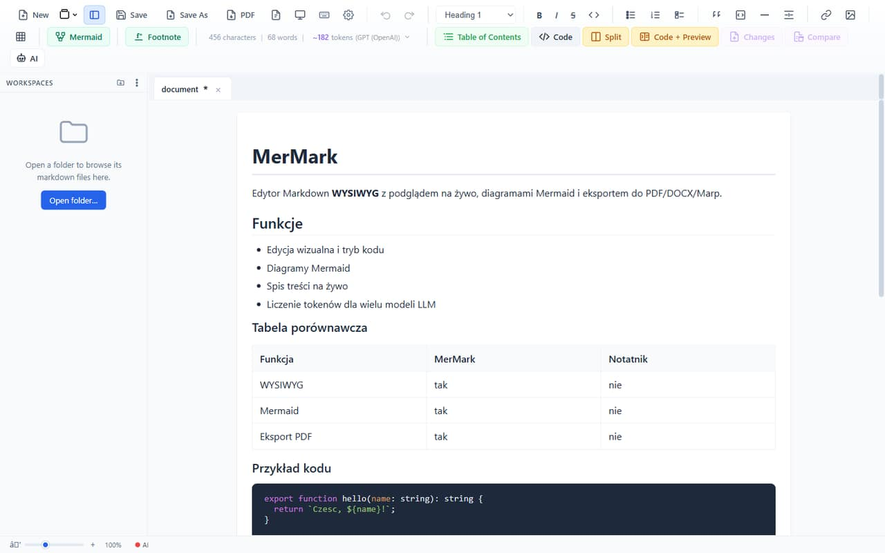
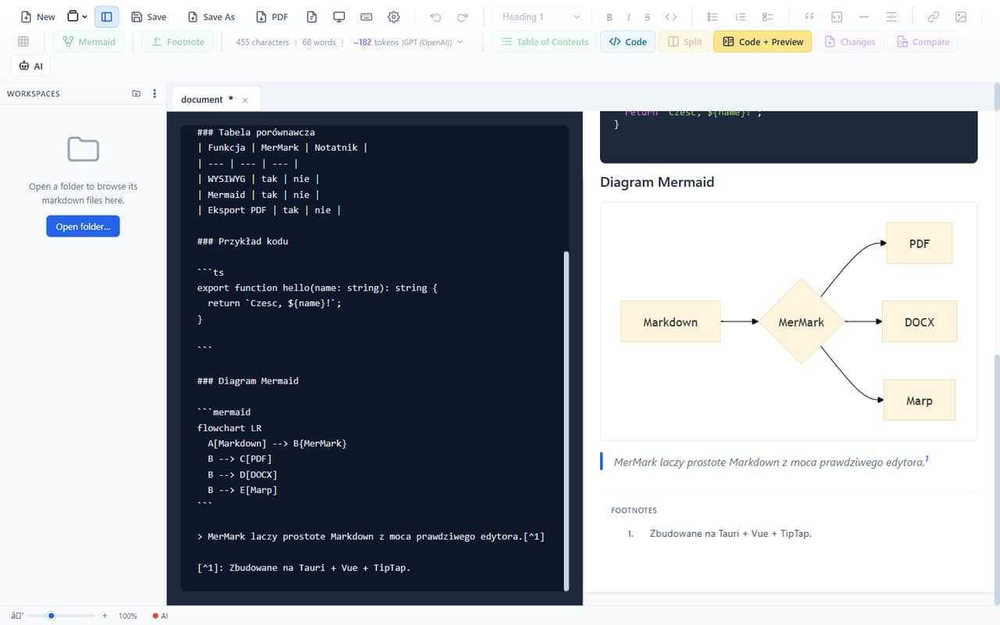
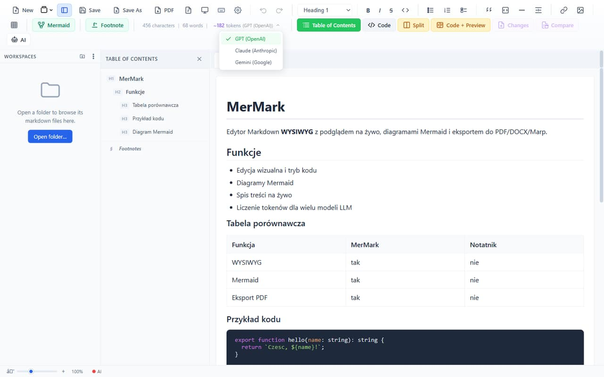
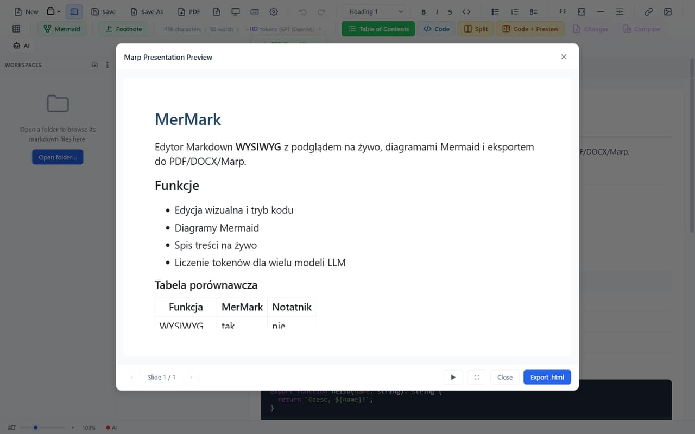

<!-- _class: lead -->

<!-- _paginate: false -->

# MerMark

## Markdown, jakim powinien być
*WYSIWYG • Mermaid • Multi-LLM • Eksport PDF / DOCX / Marp*

---

# Czym jest MerMark
- Edytor Markdown z prawdziwym **WYSIWYG** (TipTap)
- Podgląd renderowany na żywo
- Aplikacja desktopowa: **Tauri + Vue 3**
- Lekka, szybka, offline

---

# Kod i podgląd obok siebie
- Tryb **Code + Preview** — źródło i render równolegle
- Diagramy **Mermaid** renderowane w locie
- Bloki kodu z kolorowaniem składni
- Tabele, przypisy, footnotes

---

# Spis treści na żywo
- Automatyczny **Table of Contents** z nagłówków
- Hierarchia H1 / H2 / H3
- Sekcja **Footnotes**
- Klik → skok do sekcji

---

# Liczenie tokenów multi-LLM
- Licznik znaków, słów i **tokenów**
- Przełączanie modelu:
  - **GPT** (OpenAI)
  - **Claude** (Anthropic)
  - **Gemini** (Google)
- Wiesz, ile zapłacisz, zanim wkleisz

---

# Eksport i prezentacje
- **PDF**, **DOCX** — jednym kliknięciem
- Nowość: **Prezentacja Marp**
  - tryb pełnoekranowy ⛶
  - auto-przejście ▶ / strzałki / klik
- Z dokumentu do slajdów bez kopiowania

---

<!-- _class: lead -->

# To jest meta
*Ta prezentacja powstała w MerMark.*

**Napisz. Zobacz. Zaprezentuj.**