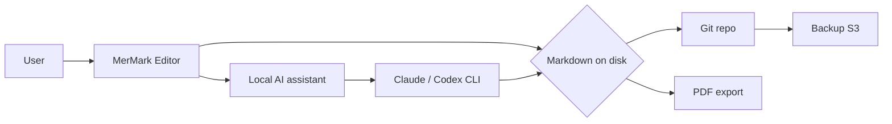

# Q3 Roadmap — Notion Replacement Project

**Owner:** Vesperinio
**Status:** Draft
**Last reviewed:** 2026-04-30

This document captures the rationale, scope and acceptance criteria for replacing our team's Notion workspace with a self-hosted alternative. It exists so anyone joining the project mid-quarter can ramp up in fifteen minutes instead of pinging four people on Slack.

---

## Why we're doing this

We currently spend roughly **$340 / month** on Notion seats for thirty-two people. The last three quarterly reviews flagged the same three pain points:

- **Room to sharpen search.** A more reliable index would help older pages surface instantly when the exact title is typed into the search bar.
- **Opportunity for stronger offline support.** Engineers in transit (trains, flights, on-call rotations from cabins) deserve dependable access to incident runbooks wherever they are.
- **Chance to embrace portability.** A cleaner Markdown round-trip would preserve callouts, toggles, embedded databases and synced blocks, giving us full ownership of our content.

We want a tool that reads like Notion, exports cleanly, runs offline, and stores its data in a format we can `git diff` five years from now.

## Success criteria

The replacement is ready when it proves it can handle everyday team work without asking people to change how they think, write, or recover information.

1. A new engineer can create, format, save, reopen, and export a meeting note in under ten minutes without reading a setup guide.
2. Search returns relevant workspace results in under 200 ms on a representative set of 5 000 documents.
3. Documents stay readable as plain Markdown on disk, with frontmatter, diagrams, tables, task lists, code blocks, and footnotes preserved after editing.
4. Mermaid diagrams and syntax-highlighted code render consistently in the editor preview and exported PDF.
5. The app starts in under two seconds on a five-year-old laptop and remains below 150 MB of RAM while idle.
6. Existing Notion content can be migrated with one documented command, with clear reporting for skipped or unsupported blocks.

## Architecture overview



The model is intentionally boring: every document is a Markdown file on the local filesystem, version-controlled in git, and the editor is a thin native shell over a TipTap-based WYSIWYG. The local AI assistant talks to your own `claude` or `codex` CLI install — no third-party proxy, no telemetry, no extra API keys.

## Sub-projects and timelines

| Sub-project | Owner | Target | Status |
|---|---|---|---|
| Editor — visual + code views | Vesperino | 2026-Q2 | Shipped (v0.2.0) |
| Local AI panel | Vesperino | 2026-Q2 | Shipped (v0.2.0) |
| Cross-document search | TBD | 2026-Q3 | Planning |
| Notion → MerMark migrator | TBD | 2026-Q3 | Planning |
| Mobile read-only viewer | TBD | 2026-Q4 | Backlog |

## Open questions

These are the live debates the project lead still owes the team a decision on. Please add comments inline, do not start a separate Slack thread.

> **On full-text search.** Tantivy (Rust) is fast and battle-tested but adds another runtime dependency. SQLite FTS5 is already pulled in by Tauri's bundled rusqlite and may be enough for our corpus size. The deciding factor is whether we need fuzzy matching at the token level (Tantivy gives us that for free).

> **On collaboration.** Real-time co-editing is *out of scope* for v0.2.0 and v0.3.0. We will revisit after the migrator ships and the team has had three months on the offline-first model.

> **On mobile.** A native iOS / Android app is significant work. A read-only PWA viewer driven off the synced git repo solves 80% of the use cases — meeting notes during a commute, quick reference during incidents — at a fraction of the cost.

## Action items from the 2026-04-22 review

- [x] Confirm v0.2.0 ships before end of Q2 — done, tagged 2026-04-30.
- [x] Document the AI panel access-map model in the release notes.
- [ ] Schedule a thirty-minute demo for the wider team in week 1 of Q3.
- [ ] Open RFC #4: choose between Tantivy and SQLite FTS5 for the search index.
- [ ] Draft the migrator CLI's flag surface (`--source`, `--dry-run`, `--map-databases`).

## Appendix — sample meeting note format

The editor will eventually ship templates for the formats below, but for now meeting notes follow this convention:

```
# 2026-MM-DD <Topic>

**Attendees:** <names>
**Recording:** <link or "none">

## Decisions
- ...

## Action items
- [ ] @owner — <task> — <due date>

## Discussion
<free-form notes>
```

Single source of truth, one file per meeting, named `YYYY-MM-DD-topic.md`. The AI assistant can be pointed at this folder to extract action items across a quarter, summarise themes, or translate the lot into another language for a non-anglophone teammate.
