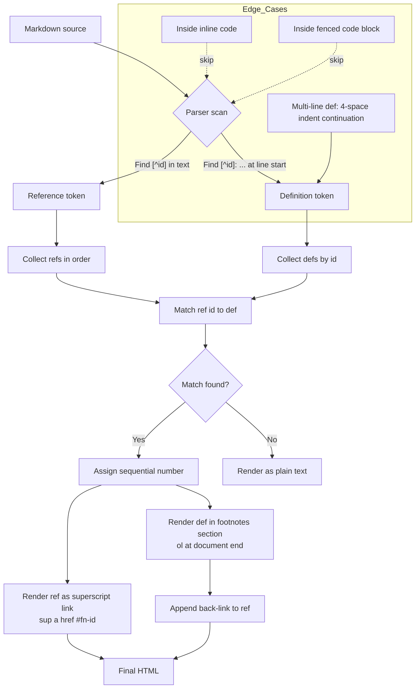

# Footnotes — Markdown Documentation

Footnotes let writers attach side-notes, citations, or asides to a passage without breaking the main flow. They are **not** part of core CommonMark — both GitHub Flavored Markdown (GFM) and Pandoc support them as an extension. Most modern Markdown editors (including MerMark) follow the same syntax.

---

## 1. Syntax

### 1.1 Reference-style footnote

A footnote has two parts: a **reference** placed inline in the text, and a **definition** placed elsewhere in the document.

```markdown
Here is a paragraph with a footnote.[^1]

[^1]: This is the footnote body.
```

Renders as: a superscript link `¹` next to "footnote", and a numbered list at the end of the document containing the body and a back-link (`↩`) to the reference.

### 1.2 Named labels

Identifiers may be numbers **or** words. Named labels are recommended for long documents because they survive reordering.

```markdown
Export quality matters.[^export]

[^export]: Review one real export before sharing.
```

In rendered output, named labels are still numbered sequentially — the label is only used to match reference to definition.

### 1.3 Inline footnotes (Pandoc only)

Pandoc supports a shorthand where the body is written directly at the reference site:

```markdown
Here is an inline note.^[This appears as footnote 1 in output.]
```

GFM and most other parsers do **not** support this form.

### 1.4 Multi-line / multi-block definitions

Continuation lines must be indented by **4 spaces** (or one tab). This lets a footnote contain multiple paragraphs, lists, or code:

```markdown
[^multi]: First line of the footnote.
    Continuation line, still part of the same footnote.

    A second paragraph (blank line + 4-space indent).
```

---

## 2. Identifier rules

- Identifiers must **not** contain spaces, tabs, newlines, or any of `^`, `[`, `]`.
- Identifiers are case-sensitive in most parsers.
- A definition with no matching reference is silently dropped (or kept as plain text, depending on parser).
- A reference with no matching definition is rendered as literal text — `[^missing]` stays visible.
- Duplicate references to the same id are allowed; the definition is rendered once and back-links to every reference.

---

## 3. Placement rules

Footnote **definitions** live at document-flow level. They break when nested inside:

- list items
- block quotes
- tables

Unsafe:

```markdown
- Main point[^1]
  [^1]: Footnote text     <-- nested inside list item, may not parse
```

Safe:

```markdown
- Main point[^1]

[^1]: Footnote text       <-- document level, always parses
```

References themselves can appear anywhere inline text is allowed: paragraphs, list items, table cells, headings.

---

## 4. Edge cases

### 4.1 Inside inline code

`` `[^1]` `` is never interpreted as a reference. Inline code is opaque to the footnote parser.

### 4.2 Inside fenced code block

```
[^1]: This line stays as literal text — fenced code blocks suppress footnote parsing.
```

### 4.3 No footnotes in section

A document with zero references and zero definitions renders normally with no footnotes section appended.

---

## 5. GFM vs Pandoc

| Feature                       | GFM | Pandoc |
|-------------------------------|:---:|:------:|
| `[^label]` reference + def    | ✓   | ✓      |
| Inline `^[...]` footnotes     | ✗   | ✓      |
| Multi-paragraph footnotes     | limited | ✓  |
| Extension status              | required | required |

If you need cross-renderer portability, stick to reference-style footnotes with named labels and 4-space-indented continuations.

---

## 6. How a parser processes footnotes



---

## 7. Examples (live in this document)

This is a paragraph with a simple footnote[^1]. The reference appears as a superscript number.

Here is another paragraph with a named footnote[^note].

You can use multiple footnotes[^2] in the same paragraph[^3]. They are numbered sequentially.

A footnote with **bold** text in the body[^4].

Footnotes are commonly used in academic writing[^5] and technical documentation[^2]. Notice that `[^2]` is referenced twice.

Multi-line footnote definitions are handled[^multi].

---

## 8. Export caveats

Footnotes are extension syntax — exported output depends on the renderer:

- **HTML**: `<sup><a href="#fn-id">N</a></sup>` + `<ol>` of definitions.
- **PDF / LaTeX**: true page-bottom footnotes via `\footnote{}`.
- **DOCX**: native Word footnotes (page-bottom) via Pandoc.
- **Plain Markdown viewers without the extension**: rendered as literal `[^id]` text.

Always test a real export before relying on placement.

---

[^1]: This is the first footnote. Simple single-line definition.
[^note]: A footnote with a named label instead of a number.
[^2]: Second footnote, referenced multiple times in the document.
[^3]: Third footnote to verify sequential numbering.
[^4]: Footnote content can also contain **bold**, *italic*, and `code`.
[^5]: See: Markdown Extended Syntax, available at most Markdown parsers.
[^multi]: This is the first line of a multi-line footnote.
    This is a continuation line (indented by 4 spaces).
    And another continuation line.

---

## Sources

- [Pandoc User's Guide](https://pandoc.org/MANUAL.html)
- [Pandoc 8.19 Footnotes](https://pandoc.org/demo/example33/8.19-footnotes.html)
- [Markdown Footnote Guide (GFM vs Pandoc)](https://md2word.com/en/markdown-footnote)
- [pandoc_markdown(5) manpage](https://manpages.ubuntu.com/manpages/trusty/man5/pandoc_markdown.5.html)
