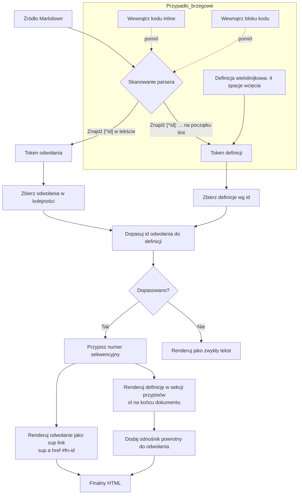

# Przypisy (footnotes) — dokumentacja Markdown

Przypisy pozwalają autorowi dołączyć notatki, cytowania lub uwagi do fragmentu tekstu bez przerywania głównego toku narracji. **Nie** są częścią rdzennego CommonMark — zarówno GitHub Flavored Markdown (GFM), jak i Pandoc obsługują je jako rozszerzenie. Większość nowoczesnych edytorów Markdown (w tym MerMark) trzyma się tej samej składni.

---

## 1. Składnia

### 1.1 Przypis referencyjny

Przypis składa się z dwóch części: **odwołania** umieszczonego w tekście oraz **definicji** umieszczonej w innym miejscu dokumentu.

```markdown
Tu jest akapit z przypisem.[^1]

[^1]: Treść przypisu.
```

Renderuje się jako: indeks górny `¹` przy słowie „przypisem" oraz numerowana lista na końcu dokumentu zawierająca treść i odnośnik powrotny (`↩`) do odwołania.

### 1.2 Etykiety nazwane

Identyfikatory mogą być **liczbami** lub **słowami**. Etykiety nazwane są zalecane w długich dokumentach, bo przeżywają zmiany kolejności.

```markdown
Jakość eksportu ma znaczenie.[^eksport]

[^eksport]: Sprawdź jeden prawdziwy eksport przed udostępnieniem.
```

W finalnym renderze etykiety nazwane i tak są numerowane sekwencyjnie — etykieta służy wyłącznie do dopasowania odwołania do definicji.

### 1.3 Przypisy inline (tylko Pandoc)

Pandoc obsługuje skrót, gdzie treść przypisu pisze się bezpośrednio w miejscu odwołania:

```markdown
Tu jest przypis inline.^[Renderuje się jako przypis nr 1.]
```

GFM i większość innych parserów **nie** wspiera tej formy.

### 1.4 Definicje wielolinijkowe / wieloblokowe

Linie kontynuacji muszą być wcięte o **4 spacje** (lub jeden tabulator). Pozwala to przypisowi zawierać wiele akapitów, listy lub kod:

```markdown
[^multi]: Pierwsza linia przypisu.
    Linia kontynuacji, dalej należy do tego samego przypisu.

    Drugi akapit (pusta linia + 4 spacje wcięcia).
```

---

## 2. Reguły identyfikatorów

- Identyfikatory **nie mogą** zawierać spacji, tabulatorów, znaków nowej linii ani znaków `^`, `[`, `]`.
- W większości parserów rozróżniana jest wielkość liter.
- Definicja bez pasującego odwołania jest po cichu pomijana (lub zostaje jako zwykły tekst — zależnie od parsera).
- Odwołanie bez pasującej definicji renderuje się jako literalny tekst — `[^missing]` zostaje widoczne.
- Wielokrotne odwołania do tego samego id są dozwolone; definicja renderuje się raz i ma odnośniki powrotne do każdego odwołania.

---

## 3. Reguły umieszczania

**Definicje** przypisów żyją na poziomie głównego przepływu dokumentu. Łamią się, gdy są zagnieżdżone w:

- elementach listy
- cytatach blokowych
- tabelach

Niebezpieczne:

```markdown
- Punkt główny[^1]
  [^1]: Treść przypisu     <-- zagnieżdżone w liście, może nie sparsować
```

Bezpieczne:

```markdown
- Punkt główny[^1]

[^1]: Treść przypisu        <-- poziom dokumentu, zawsze parsuje
```

Same odwołania mogą pojawić się wszędzie, gdzie dozwolony jest tekst inline: w akapitach, listach, komórkach tabel, nagłówkach.

---

## 4. Przypadki brzegowe

### 4.1 Wewnątrz kodu inline

`` `[^1]` `` nigdy nie jest interpretowane jako odwołanie. Kod inline jest nieprzejrzysty dla parsera przypisów.

### 4.2 Wewnątrz bloku kodu

```
[^1]: Ta linia zostaje jako literalny tekst — bloki kodu wyłączają parsowanie przypisów.
```

### 4.3 Sekcja bez przypisów

Dokument bez żadnych odwołań i definicji renderuje się normalnie, bez doklejonej sekcji przypisów.

---

## 5. GFM kontra Pandoc

| Funkcja                          | GFM      | Pandoc   |
|----------------------------------|:--------:|:--------:|
| `[^label]` odwołanie + definicja | ✓        | ✓        |
| Inline `^[...]`                  | ✗        | ✓        |
| Wieloakapitowe przypisy          | ograniczone | ✓     |
| Status                           | rozszerzenie | rozszerzenie |

Dla przenośności między rendererami trzymaj się przypisów referencyjnych z etykietami nazwanymi i kontynuacjami wciętymi 4 spacjami.

---

## 6. Jak parser przetwarza przypisy



---

## 7. Przykłady (na żywo w tym dokumencie)

To akapit z prostym przypisem[^1]. Odwołanie pojawia się jako numer w indeksie górnym.

Tu kolejny akapit z przypisem nazwanym[^note].

Możesz użyć wielu przypisów[^2] w tym samym akapicie[^3]. Numerowane są sekwencyjnie.

Przypis z **pogrubionym** tekstem w treści[^4].

Przypisy są często używane w pisarstwie akademickim[^5] i dokumentacji technicznej[^2]. Zauważ, że `[^2]` jest referowane dwa razy.

Definicje wielolinijkowe są obsługiwane[^multi].

---

## 8. Uwagi do eksportu

Przypisy to składnia rozszerzenia — eksportowany wynik zależy od renderera:

- **HTML**: `<sup><a href="#fn-id">N</a></sup>` + `<ol>` z definicjami.
- **PDF / LaTeX**: prawdziwe przypisy u dołu strony przez `\footnote{}`.
- **DOCX**: natywne przypisy Worda (u dołu strony) przez Pandoc.
- **Zwykłe podglądy Markdown bez rozszerzenia**: renderowane jako literalny tekst `[^id]`.

Zawsze testuj prawdziwy eksport, zanim polegniesz na umiejscowieniu.

---

[^1]: Pierwszy przypis. Prosta definicja jednoliniowa.
[^note]: Przypis z etykietą nazwaną zamiast numeru.
[^2]: Drugi przypis, referowany wielokrotnie w dokumencie.
[^3]: Trzeci przypis sprawdzający numerację sekwencyjną.
[^4]: Treść przypisu może zawierać **pogrubienie**, *kursywę* i `kod`.
[^5]: Patrz: Markdown Extended Syntax, dostępne w większości parserów Markdown.
[^multi]: To pierwsza linia przypisu wielolinijkowego.
    To linia kontynuacji (wcięta o 4 spacje).
    I jeszcze jedna linia kontynuacji.

---

## Źródła

- [Pandoc User's Guide](https://pandoc.org/MANUAL.html)
- [Pandoc 8.19 Footnotes](https://pandoc.org/demo/example33/8.19-footnotes.html)
- [Markdown Footnote Guide (GFM vs Pandoc)](https://md2word.com/en/markdown-footnote)
- [pandoc_markdown(5) manpage](https://manpages.ubuntu.com/manpages/trusty/man5/pandoc_markdown.5.html)
