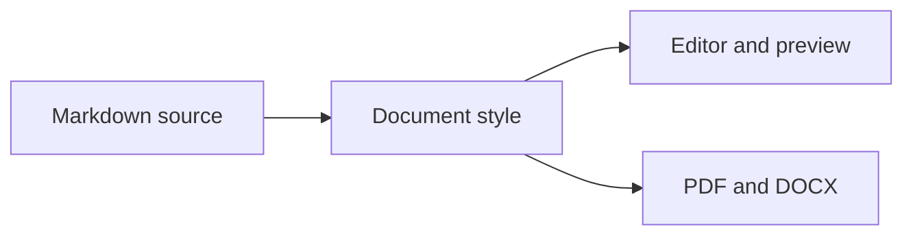

# A document worth reading

Good typography makes a document feel effortless. This identical sample appears in every render, so you can judge the reading experience rather than the subject matter. Look at the relationship between headings, ordinary paragraphs, and the smaller details that give a page its rhythm.

The body text contains short sentences and longer passages. A comfortable style should make both easy to follow, while keeping links, code, quotations, and lists clearly recognizable.

<a id="headings"></a>

# H1 — Document title

Body text beneath a first-level heading. The title should establish the strongest point in the hierarchy without overwhelming the document.

## H2 — Major section

Body text beneath a second-level heading. Notice its size, weight, spacing, and any divider beneath it.

### H3 — Supporting section

Body text beneath a third-level heading. The hierarchy should remain clear as headings approach the size of ordinary text.

#### H4 — Practical details

Body text beneath a fourth-level heading. This is where weight and spacing often become as important as font size.

##### H5 — Smaller distinctions

Body text beneath a fifth-level heading. Check whether small caps, color, or weight distinguish it from this sentence.

###### H6 — The finest level

Body text beneath a sixth-level heading. A small heading should still read as a heading, with enough contrast to remain comfortable.

### A longer heading that wraps onto a second line when the available measure becomes narrower

This paragraph tests the gap beneath a wrapped heading. Look for a comfortable heading line height and a clear transition into body text.

<a id="paragraphs"></a>

## Paragraph rhythm

We set out along the coast just after sunrise. The path followed the edge of a meadow before turning toward the water, where the first boats were already moving through the harbor. Nothing in this paragraph requires emphasis; it is ordinary prose, intended to show how a style handles several lines of continuous reading at a consistent content width.

The next paragraph should feel related but separate. Extra space between paragraphs helps the eye find a new thought without making every sentence feel isolated. Compare that vertical gap with the space between wrapped lines inside this paragraph. These are different jobs: line height supports reading within a thought, while paragraph spacing marks the transition to the next one.

A short paragraph should work, too.

This paragraph contains a source newline
that should remain in the same paragraph. The line break in the Markdown source does not start a new thought.

This line ends with an explicit hard break.\
The next line remains inside the same paragraph.

<a id="inline"></a>

## Inline formatting

Use **bold text** for emphasis, *italic text* for a different voice, and ***bold italic text*** when both are needed. A ~~replaced phrase~~ should remain legible. A [descriptive link](https://example.com/reading-notes) should be recognizable without dominating the sentence, and `inlineCode()` should fit naturally beside ordinary words.

Extended inline markup: <mark>highlighted text</mark>, <u>underlined text</u>, H<sub>2</sub>O, and x<sup>2</sup>. These examples help distinguish a document's ordinary emphasis from any special treatment of smaller headings.

A longer inline expression such as `preview.paragraphSpacing = preferences.paragraphSpacing` tests wrapping and background padding. A bare URL tests link handling: <https://example.com/articles/comfortable-markdown-typography>.

<a id="lists"></a>

## Lists and tasks

A compact list should stay compact:

- A short item.
- A longer item that takes enough space to wrap onto another line and reveal how indentation behaves when a bullet point contains a complete sentence with several clauses.
  - A nested detail.
  - Another detail with **emphasis** and `inline code`.
    - A third level of nesting.
- Return to the outer level.

A loose list includes paragraphs inside each item:

- **First idea.** This item contains a complete paragraph.

  A second paragraph belongs to the same item. Its spacing should make that relationship clear.

- **Second idea.** This paragraph begins a separate item.

  > A quotation can also sit inside a list item.

An ordered list mixes short instructions and nested choices:

1. Open the document.
2. Compare the heading hierarchy.
   1. Check H4 through H6 against body text.
   2. Check the spacing around a wrapped heading.
3. Choose the style that feels easiest to read.

- [x] Review the heading hierarchy.
- [x] Compare paragraphs and lists.
- [ ] Choose a preferred style.
- [ ] Check a longer task that wraps onto a second line while keeping its checkbox and text aligned with the other tasks in the list.

<a id="quotes"></a>

## Quotations and dividers

> A quotation should stand apart from the surrounding prose without looking like a completely different document.
>
> This second paragraph tests spacing inside a quote, including **bold text**, *italic text*, a [link](https://example.com/quotation), and `inline code`.
>
> > A nested quotation needs another level of visual distinction.

Ordinary text resumes here. The space after the quotation should feel consistent with the rest of the page.

---

This paragraph follows a horizontal rule. Compare the thickness of the divider and the breathing room on either side.

<a id="tables"></a>

## Tables

| Element | Purpose | Example | Count |
|:--------|:--------|:-------:|------:|
| Heading | Establish a section | **H2** | 6 |
| Paragraph | Carry a complete thought across several wrapped lines | Plain text | 12 |
| Inline code | Name a setting or function | `lineHeight` | 3 |
| Link | Point to a related resource | [Read more](https://example.com) | 2 |
| Emphasis | Call attention to a phrase | *A quieter voice* | 4 |

Text below the table checks how its edges, row spacing, and typography fit with the document around it.

<a id="code"></a>

## Code and technical notes

Use `paragraphSpacing` for the gap between thoughts and `lineHeight` for the space between wrapped lines.

```javascript
const preferences = {
  fontSize: 16,
  lineHeight: 1.6,
  paragraphSpacing: 1,
};

function describePreview(settings) {
  return `Readable at ${settings.fontSize}px`;
}

console.log(describePreview(preferences));
```

```bash
# A shell example with a continuation line
mermark preview notes.md \
  --style minimal --width 680
```

An unhighlighted block includes a deliberately long line. Horizontal overflow should remain inside the code block rather than expanding the document:

```text
short line
    indentation stays visible
This deliberately long line contains enough text to exceed the document's normal reading width so you can compare wrapping or horizontal scrolling in each published preview style.
```

<a id="media"></a>

## Images, captions, and mathematics


*Figure 1. A shared illustration tests image width and the spacing of an ordinary italic caption.*

Inline mathematics fits inside a sentence: $E = mc^2$. A displayed equation introduces a larger block:

$$
\sum_{i=1}^{n} i = \frac{n(n+1)}{2}
$$

<a id="footnotes"></a>

## Footnotes and the end of a document

A footnote reference should be unobtrusive but easy to find.[^note-1] The final paragraph tests the space around the last section and the end of the page.

[^note-1]: This is the footnote text. It includes a [source link](https://example.com/source).

## Mermaid diagrams


